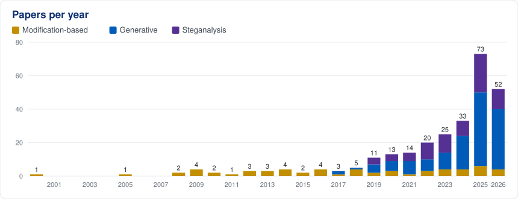
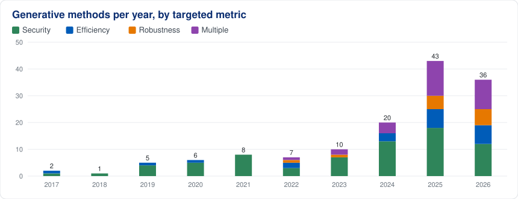
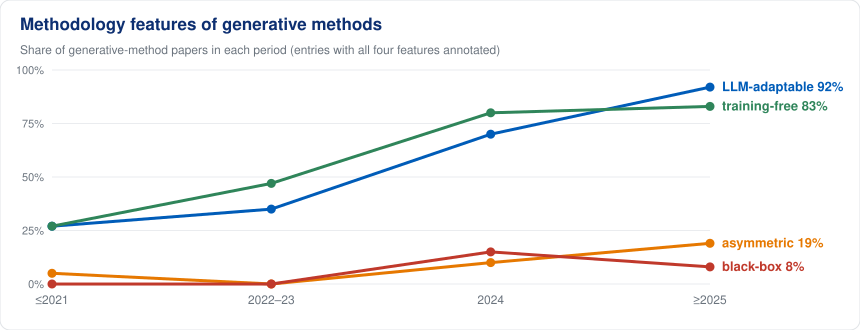
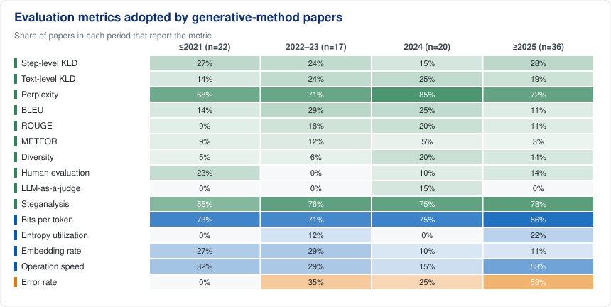
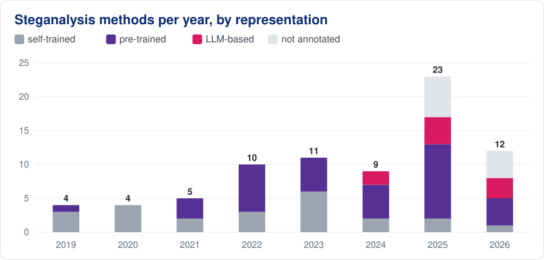
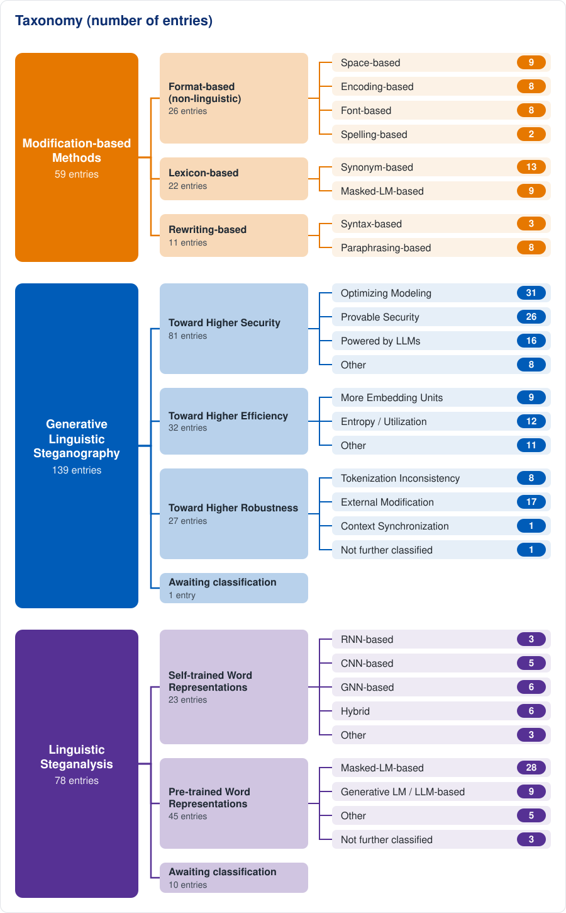

<!-- Generated by scripts/build.py from data/*.yaml and templates/README.md.tmpl. Do not edit by hand. -->

# Awesome Linguistic Steganography

[](https://awesome.re) [](#contents) [](#code-and-tools) [](https://ryehr.github.io/awesome-linguistic-steganography/) [](CONTRIBUTING.md)

A curated, data-driven collection of research on **linguistic steganography** — hiding secret messages in natural-language text — and its countermeasure, **linguistic steganalysis**.
Every entry is a structured record in [`data/`](data/), from which this README, the statistics below and the [interactive dashboard](https://ryehr.github.io/awesome-linguistic-steganography/) are generated.

The collection was seeded from our survey *[A Comprehensive Survey on Linguistic Steganography: Methods, Countermeasures, Evaluation, and Challenges](#citation)* (EMNLP 2026) and is maintained beyond it: new papers, code, datasets and benchmarks are welcome via [pull requests or issues](CONTRIBUTING.md).

## Contents

- [Dashboard](#dashboard)
- [Beyond the Survey](#beyond-the-survey)
- [Taxonomy](#taxonomy)
- [Surveys](#surveys)
- [Modification-based Methods](#modification-based-methods)
- [Generative Linguistic Steganography](#generative-linguistic-steganography)
- [Linguistic Steganalysis](#linguistic-steganalysis)
- [Evaluation Metrics](#evaluation-metrics)
- [Datasets and Benchmarks](#datasets-and-benchmarks)
- [Code and Tools](#code-and-tools)
- [Open Problems](#open-problems)
- [Contributing](#contributing)
- [Citation](#citation)

## Dashboard

**283** entries, including **198** steganographic methods. Filter, sort and search all of them on the **[interactive dashboard](https://ryehr.github.io/awesome-linguistic-steganography/)**.

| | Entries | With code |
|---|:-:|:-:|
| [Surveys](#surveys) | 7 | 0 |
| [Modification-based](#modification-based-methods) | 59 | 0 |
| [Generative](#generative-linguistic-steganography) | 139 | 5 |
| [Steganalysis](#linguistic-steganalysis) | 78 | 3 |
| [Evaluation metrics](#evaluation-metrics) | 23 | |
| [Datasets](#datasets-and-benchmarks) | 4 | |











**Help wanted:** 39 entries still lack a paper link and 275 lack a code link. If you know one, please [open an issue](https://github.com/ryehr/awesome-linguistic-steganography/issues/new/choose).

## Beyond the Survey

**72** papers added after the survey's literature cut-off, newest first. A [monthly search](.github/workflows/new-papers.yml) of arXiv, OpenAlex and Crossref opens an issue with fresh candidates for review.

<details>
<summary><b>Show the 72 papers</b></summary>

- `Modification-based` **A Secure Data Hiding Approach Using Natural Language Processing** — Nirmalya Kar et al. *International Journal of Computational Intelligence Systems 2026*. [[Paper]](https://doi.org/10.1007/s44196-026-01253-8)
- `Generative` **Alkaid: Resilience to Edit Errors in Provably Secure Steganography via Distance-Constrained Encoding** — Zhihan Cao et al. *arXiv 2026*. [[arXiv]](https://arxiv.org/abs/2603.06169) `multi-objective`
- `Generative` **An Additive Approximation Scheme for Generating Dyadic Codings for the Outputs of an LLM** — Daniella Bar-Lev et al. *arXiv 2026*. [[arXiv]](https://arxiv.org/abs/2605.05837) `multi-objective`
- `Steganalysis` **Anomaly-Guided Test-time Adaptation for Linguistic Steganalysis** — Haowei Chang et al. *ACM IH&MMSec 2026*. [[Paper]](https://doi.org/10.1145/3785353.3815069)
- `Modification-based` **BioStegoScript**: Arabic calligraphy-based text steganography framework with biologically-encoded secret messages, enhanced embedding capacity and automated extraction — Mohammad Nassef and Ali A. Hamzah. *PeerJ Computer Science 2026*. [[Paper]](https://doi.org/10.7717/peerj-cs.3931)
- `Generative` **Asymmetric Resource Constrained Decoding for Lightweight Linguistic Steganography in Causal LLMs** — Paweł Moszczyński et al. *ARES 2026*. [[Paper]](https://doi.org/10.1007/978-3-032-37218-5_7) `asymmetric`
- `Generative` **Black-Box Steganography for Large Language Models via Preference Ranking** — Zhengkang Shao et al. *PRMVAI 2026*. [[Paper]](https://doi.org/10.1109/prmvai70103.2026.11605556) `black-box`
- `Steganalysis` **Breaking the "Provable Security": Detecting Finite-Precision Artifacts in LLM-based Steganography via Low-Probability Vanishing** — Wenzhao Cao et al. *Findings of ACL 2026*. [[Paper]](https://doi.org/10.18653/v1/2026.findings-acl.1013) `pre-trained` `LLM-based`
- `Generative` **Breaking the Generative Steganography Trilemma: ANStega for Optimal Capacity, Efficiency, and Security** — Yaofei Wang et al. *NDSS 2026*. [[Paper]](https://doi.org/10.14722/ndss.2026.240605) `multi-objective`
- `Generative` **CARTS: Contextual Autoregressive Rank Transcoding Steganography for Full-Capacity Keyed Text Encoding** — Wissam Ghantous and Alexander V. Mantzaris. *arXiv 2026*. [[arXiv]](https://arxiv.org/abs/2609.10744) `multi-objective`
- `Generative` **Codetta: High-Capacity, Keyless, and Undetectable Multi-Agent Collusion** — Qi Pang et al. *arXiv 2026*. [[arXiv]](https://arxiv.org/abs/2609.28900) `multi-objective`
- `Generative` **Conceptual Steganography** — Zhejian Zhou and Jonathan May. *arXiv 2026*. [[arXiv]](https://arxiv.org/abs/2605.26537)
- `Generative` **DualSteg: High-Capacity Provably Secure Text Steganography in Asymmetric Resource Scenario via Dual-Scale LLMs** — Haocheng Fu et al. *ICASSP 2026*. [[Paper]](https://doi.org/10.1109/icassp55912.2026.11465154) `asymmetric` `multi-objective`
- `Generative` **Emotion-Driven Steganography for Short-Text Communication: Securing Social Media with Affective Triplet Embedding and Similarity-Gray Coding** — Zhennan Wang et al. *AIS 2026*. [[Paper]](https://doi.org/10.1109/ais69919.2026.11621704)
- `Generative` **Entropy-Steering: A Lookahead Approach to High-Capacity Generative Linguistic Steganography** — Emile Johnston. *Master's thesis, TU Wien 2026*. [[Paper]](https://doi.org/10.34726/hss.2026.133201)
- `Steganalysis` **FADRW: A Feature-Aware Modulated and Dynamically Reweighted Loss for Few-Shot Linguistic Steganalysis** — Shuo Liu et al. *IEEE SPL 2026*. [[Paper]](https://doi.org/10.1109/LSP.2026.3700567) [[arXiv]](https://arxiv.org/abs/2606.07655)
- `Generative` **Feedback Coding Enables Inference-Time Covert Agentic Communication** — Sidong Guo et al. *arXiv 2026*. [[arXiv]](https://arxiv.org/abs/2609.24994) `black-box`
- `Modification-based` **High embedding capacity text steganography using optimal color combinations from 24-bit space** — Stéphane Willy Mossebo Tcheunteu et al. *Journal of Computer Security 2026*. [[Paper]](https://doi.org/10.1177/0926227x251411812)
- `Generative` **HiTMS: A High-Throughput Multi-Stream Linguistic Steganography Framework** — Ruiyi Yan et al. *arXiv 2026*. [[arXiv]](https://arxiv.org/abs/2607.23597)
- `Steganalysis` **HTLIN-Stega: Hierarchical Text-Label Integration Network for Text Steganalysis** — Juan Wen et al. *Chinese Journal of Electronics 2026*. [[Paper]](https://doi.org/10.23919/cje.2024.00.245)
- `Generative` **Improving the Efficiency of Lossless Embedding in Text Steganography** — Nikolai V. Teterev and Alla B. Levina. *SmartIndustryCon 2026*. [[Paper]](https://doi.org/10.1109/smartindustrycon68821.2026.11492963)
- `Steganalysis` **Kolmogorov Complexity Bounds for LLM Steganography and a Perplexity-Based Detection Proxy** — Andrii Shportko. *arXiv 2026*. [[arXiv]](https://arxiv.org/abs/2603.21567) `pre-trained`
- `Generative` **Large Language Models and Hybrid Prompt Engineering for Emotional Text Steganography Based on Cloud** — Ameer Kadhim Hadi. *CCIS 2026*. [[Paper]](https://doi.org/10.1007/978-3-032-25568-6_24)
- `Generative` **PE-Stega: A Robust Visually-Enhanced Linguistic Steganography Framework for Social Networks** — Jiacheng Fan et al. *ICANN 2026*. [[Paper]](https://doi.org/10.1007/978-3-032-38407-2_2)
- `Generative` **Provably Secure Steganography Based on List Decoding** — Kaiyi Pang and Minhao Bai. *arXiv 2026*. [[arXiv]](https://arxiv.org/abs/2604.21394) `multi-objective`
- `Steganalysis` **Q-HiDu**: Qwen-Enhanced Hierarchical Dual-Attention Network for Text Steganalysis — Yexin Zhang et al. *CSAIDE 2026*. [[Paper]](https://doi.org/10.1145/3819836.3819840) `pre-trained` `LLM-based`
- `Generative` **Rank-Token Mapping Steganography in LLM Chatbots: Evaluating Capacity and Performance Across Multiple LLMs** — Kamil Pinas et al. *Electronics 2026*. [[Paper]](https://doi.org/10.3390/electronics15184251)
- `Steganalysis` **REED: Post-Training Representation Editing for Cross-Domain Linguistic Steganalysis** — Ruohan Lei et al. *arXiv 2026*. [[arXiv]](https://arxiv.org/abs/2605.28298) `pre-trained`
- `Generative` **Robust Coverless Linguistic Steganography via Sentence Embedding Space with Global Resynchronization** — Lizhi Xiong et al. *arXiv 2026*. [[arXiv]](https://arxiv.org/abs/2609.04970)
- `Generative` **Robust Semantic Steganography via Large Language Models** — Xiaohui Li et al. *NaNA 2026*. [[Paper]](https://doi.org/10.23919/nanacps00070.2026.00072)
- `Generative` **RS-Stega: A Token-Level Quality-Control Framework for Generative Text Steganography** — Pengtao Wang et al. *APWeb-WAIM 2026*. [[Paper]](https://doi.org/10.1007/978-981-95-5716-5_6)
- `Modification-based` **LDStega**: Semantic compensation-driven low-distortion linguistic steganography — Lingyun Xiang et al. *IJAACS 2026*. [[Paper]](https://doi.org/10.1504/ijaacs.2026.152851)
- `Generative` **Semantic Length Limits in LLM Based Steganography** — Haley Stinebrickner et al. *FLAIRS 2026*. [[Paper]](https://doi.org/10.32473/flairs.39.1.141579)
- `Generative` **SemanticZip: Improving Text Steganographic Capacity via LLM-Guided Semantic Lossless Compression** — Shi Ke et al. *SSRN 2026*. [[Paper]](https://doi.org/10.2139/ssrn.7118010)
- `Generative` **Steganography with Large Language Models** — Alexander V. Mantzaris et al. *FLAIRS 2026*. [[Paper]](https://doi.org/10.32473/flairs.39.1.141573)
- `Generative` **Steganography Without Modification: Hidden Communication via LLM Seeds** — Felix Mächtle et al. *arXiv 2026*. [[arXiv]](https://arxiv.org/abs/2606.09135)
- `Generative` **SLS**: Synchronized Logit Steering: Real-world Steganography — Andrew Rufail et al. *arXiv 2026*. [[arXiv]](https://arxiv.org/abs/2608.14697)
- `Steganalysis` **HAM-Stega**: Text Steganalysis Method Based on Hierarchy-Aware Matching — JIA Jianghao, ZHANG Ziwei, GAO Liting, WEN Juan, XUE Yiming. *Computer Engineering 2026*. [[Paper]](https://doi.org/10.19678/j.issn.1000-3428.0069385)
- `Generative` **TI-StegoAlign: Channel-Guided Post-Training for Generative Text Steganography under Tokenization Inconsistency** — Jiuan Zhou et al. *arXiv 2026*. [[arXiv]](https://arxiv.org/abs/2608.00382)
- `Generative` **Tool Use Enables Undetectable Steganography in Multi-Agent LLM Systems** — Jimmy Laurence Rippin et al. *arXiv 2026*. [[arXiv]](https://arxiv.org/abs/2606.28425)
- `Generative` **Undetectable Conversations Between AI Agents via Pseudorandom Noise-Resilient Key Exchange** — Vinod Vaikuntanathan and Or Zamir. *arXiv 2026*. [[arXiv]](https://arxiv.org/abs/2604.04757)
- `Generative` **A Character-based Diffusion Embedding Algorithm for Enhancing the Generation Quality of Generative Linguistic Steganographic Texts** — Yingquan Chen et al. *arXiv 2025*. [[arXiv]](https://arxiv.org/abs/2505.00977)
- `Generative` **A high-capacity linguistic steganography based on entropy-driven rank-token mapping** — Jun Jiang et al. *arXiv 2025*. [[arXiv]](https://arxiv.org/abs/2510.23035)
- `Generative` **A Novel Framework of Semantic-Based Text Steganography** — Jinshuai Yang et al. *IEEE TDSC 2025*. [[Paper]](https://doi.org/10.1109/tdsc.2025.3632510) `multi-objective`
- `Generative` **Advanced Text Steganography Using Variational Autoencoders and Greedy Sampling** — Tarush Chintala et al. *RDICCT 2025*. [[Paper]](https://doi.org/10.5220/0013921200004919)
- `Steganalysis` **Aggregated text steganalysis toward social network based on efficient multi-perspective feature fusion** — Qiong Xu et al. *Knowledge-Based Systems 2025*. [[Paper]](https://doi.org/10.1016/j.knosys.2025.115129)
- `Modification-based` **AI-generated text steganography - hiding secrets in plain sight using synonym encoding** — Petar Stoilov and Plamen Zahariev. *Cyber-AI 2025*. [[Paper]](https://doi.org/10.1109/cyber-ai66431.2025.11233312)
- `Surveys` **AI-Powered Steganography: Advances in Image, Linguistic, and 3D Mesh Data Hiding – A Survey** — De Rosal Ignatius Moses Setiadi et al. *Journal of Future Artificial Intelligence and Technologies 2025*. [[Paper]](https://doi.org/10.62411/faith.3048-3719-76)
- `Steganalysis` **Class-Aware Adversarial Unsupervised Domain Adaptation for Linguistic Steganalysis** — Zhen Yang et al. *IEEE TIFS 2025*. [[Paper]](https://doi.org/10.1109/tifs.2025.3569409) `pre-trained`
- `Steganalysis` **CASS-LS**: Context-Aware and Semantic-Synergistic Linguistic Steganalysis for Social Networks — Yuwen Jiang et al. *IEEE SPL 2025*. [[Paper]](https://doi.org/10.1109/lsp.2025.3639346)
- `Generative` **Contextual Coherence Evaluation of Perfectly Secure Steganography in Text Documents** — Katsuyuki Umezawa et al. *LNCS 2025*. [[Paper]](https://doi.org/10.1007/978-3-032-00635-6_14)
- `Generative` **Covert Text Communication Using GPT-Based Language Models and Semantic Similarity Constraints** — Megala Rajendran and Priya Vij. *ICNGCS 2025*. [[Paper]](https://doi.org/10.1109/icngcs64900.2025.11183393)
- `Steganalysis` **Cross-domain text steganalysis based on domain adversarial learning** — Haiping NIE et al. *Scientia Sinica Informationis 2025*. [[Paper]](https://doi.org/10.1360/ssi-2024-0352) `pre-trained`
- `Generative` **DA-Mamba Stega: Linguistic Steganography Based on Data Augmentation and Mamba Blocks** — Qing Chang et al. *IEEE SWC 2025*. [[Paper]](https://doi.org/10.1109/swc65939.2025.00130)
- `Steganalysis` **Domain-Assisted Few-Shot Linguistic Steganalysis in Imbalanced Class Scenarios** — Qingying Niu et al. *IEEE SPL 2025*. [[Paper]](https://doi.org/10.1109/lsp.2025.3553427)
- `Generative` **Emoji-Stega: An Emoji-Powered Linguistic Steganography Framework for Social Networks** — Jiacheng Fan et al. *NLPCC 2025*. [[Paper]](https://doi.org/10.1007/978-981-95-3352-7_11)
- `Modification-based` **Enhancing Imperceptibility: Zero-width Character-based Text Steganography for Preserving Message Privacy** — Saqib Ishtiaq et al. *Acta Informatica Pragensia 2025*. [[Paper]](https://doi.org/10.18267/j.aip.271)
- `Surveys` **Enhancing Knowledge Security through Text Steganography: A Review of Techniques and Tools** — Mohd Hilal Muhammad et al. *Journal of Information System and Technology Management 2025*. [[Paper]](https://doi.org/10.35631/jistm.1038022)
- `Generative` **Hiding in Meaning: Semantic Encoding for Generative Text Steganography** — Oleg Y. Rogov et al. *Russian Digital Libraries Journal 2025*. [[Paper]](https://doi.org/10.26907/1562-5419-2025-28-5-1165-1185)
- `Modification-based` **Innamark: A Whitespace Replacement Information-Hiding Method** — Malte Hellmeier et al. *IEEE Access 2025*. [[Paper]](https://doi.org/10.1109/ACCESS.2025.3583591) [[arXiv]](https://arxiv.org/abs/2502.12710)
- `Generative` **Linguistic Steganography in Text with Artificial Intelligence** — Barbara Emma Sánchez Rinza and Mariano AldairAquino Regalado. *ICECER 2025*. [[Paper]](https://doi.org/10.1109/icecer65523.2025.11400752)
- `Steganalysis` **LLM-Based Tuning-Free Linguistic Steganalysis** — Yuyi Wang et al. *EIECT 2025*. [[Paper]](https://doi.org/10.1109/eiect68017.2025.11332162) `pre-trained` `LLM-based`
- `Generative` **Manhuff: Adaptive Inverted Huffman Coding for High-Capacity Imperceptible Generative Linguistic Steganography** — Yu Liu et al. *IEEE ISPA 2025*. [[Paper]](https://doi.org/10.1109/ispa67752.2025.00190) `multi-objective`
- `Steganalysis` **MSED: A Linguistic Steganalysis Method Based on Multi-granularity Semantic Extraction Using Dual-Mode Fusion** — Huifeng Li et al. *ACNS 2025*. [[Paper]](https://doi.org/10.1007/978-3-031-95764-2_8)
- `Generative` **Multi-Channel Linguistic Steganography Using Frequency Multiplexing and Minimum Entropy Coupling** — Jeanne-Louise Shih. *TechRxiv 2025*. [[Paper]](https://doi.org/10.36227/techrxiv.176288326.62494538/v1)
- `Steganalysis` **Multi-Classification of Linguistic Steganography Driven by Large Language Models** — Jie Wang et al. *IEEE SPL 2025*. [[Paper]](https://doi.org/10.1109/lsp.2025.3545947) `pre-trained` `LLM-based`
- `Generative` **Position-Agnostic Probabilistic Generation for Robust Steganographic Text** — Shuo Lin et al. *CIKM 2025*. [[Paper]](https://doi.org/10.1145/3746252.3760861)
- `Modification-based` **GPC**: Raster Domain Text Steganography: A Unified Framework for Multimodal Secure Embedding — A V Uday Kiran Kandala. *arXiv 2025*. [[arXiv]](https://arxiv.org/abs/2512.21698)
- `Generative` **Shifting-Merging: Secure, High-Capacity and Efficient Steganography via Large Language Models** — Minhao Bai et al. *arXiv 2025*. [[arXiv]](https://arxiv.org/abs/2501.00786) `multi-objective`
- `Steganalysis` **SN-Stego: Dataset for Social Networks Text Steganalysis via Local Group Discovery and Sample Distribution Regulation** — Qiong Xu et al. *Data Intelligence 2025*. [[Paper]](https://doi.org/10.3724/2096-7004.di.2025.0126)
- `Steganalysis` **Synonym Substitution Steganalysis Based on Heterogeneous Feature Extraction and Hard Sample Mining Re-Perception** — Jingang Wang et al. *Big Data and Cognitive Computing 2025*. [[Paper]](https://doi.org/10.3390/bdcc9080192)
- `Generative` **TrojanStego: Your Language Model Can Secretly Be A Steganographic Privacy Leaking Agent** — Dominik Meier et al. *EMNLP 2025*. [[Paper]](https://doi.org/10.18653/v1/2025.emnlp-main.1386) [[arXiv]](https://arxiv.org/abs/2505.20118)

</details>

## Taxonomy

Methods are organised by *how* bits are embedded (modifying a covertext vs. generating a stegotext) and, for generative methods, by the *targeted metric* (security, efficiency, robustness). Steganalysis methods are organised by the representations they build on. Numbers are entry counts; an entry may belong to several categories.



## Surveys

- **This survey**: A Comprehensive Survey on Linguistic Steganography: Methods, Countermeasures, Evaluation, and Challenges — Ruiyi Yan et al. *EMNLP 2026*. — covers 148 methods, 60 steganalysis, 23 metrics
- **AI-Powered Steganography: Advances in Image, Linguistic, and 3D Mesh Data Hiding – A Survey** — De Rosal Ignatius Moses Setiadi et al. *Journal of Future Artificial Intelligence and Technologies 2025*. [[Paper]](https://doi.org/10.62411/faith.3048-3719-76)
- **Enhancing Knowledge Security through Text Steganography: A Review of Techniques and Tools** — Mohd Hilal Muhammad et al. *Journal of Information System and Technology Management 2025*. [[Paper]](https://doi.org/10.35631/jistm.1038022)
- **Linguistic Steganography and Linguistic Steganalysis** — Hanzhou Wu et al. *Adversarial Multimedia Forensics 2024*. [[Paper]](https://doi.org/10.1007/978-3-031-49803-9_7) — covers 28 methods, 29 steganalysis, 8 metrics
- **A Comprehensive Review on Deep Learning-Based Generative Linguistic Steganography** — Israa Lotfy Badawy et al. *Learning in the Age of Digital and Green Transition 2023*. — covers 18 methods, 12 metrics
- **Generative Linguistic Steganography: A Comprehensive Review.** — Lingyun Xiang et al. *KSII TIIS 2022*. — covers 37 methods, 11 metrics
- **A Review on Text Steganography Techniques** — Mohammed Abdul Majeed et al. *Mathematics 2021*. [[Paper]](https://doi.org/10.3390/math9212829) — covers 50 methods

## Modification-based Methods

Embed bits by editing an existing covertext; lightweight, but capacity is bounded by the editable positions.

### Format-based (non-linguistic) (26)

Exploit physical features of text symbols without changing the linguistic content.

#### Space-based (9)

*Bits in line / word / character spacing or invisible whitespace.*

- **Innamark: A Whitespace Replacement Information-Hiding Method** — Malte Hellmeier et al. *IEEE Access 2025*. [[Paper]](https://doi.org/10.1109/ACCESS.2025.3583591) [[arXiv]](https://arxiv.org/abs/2502.12710)
- **A new 3-bit hiding covert channel algorithm for public data and medical data security using format-based text steganography** — R Gurunath and Debabrata Samanta. *Journal of Database Management (JDM) 2023*.
- **A space based reversible high capacity text steganography scheme using font type and style** — Rajeev Kumar et al. *ICCCA 2016*. [[Paper]](https://doi.org/10.1109/CCAA.2016.7813878)
- **Text steganography: a novel character-level embedding algorithm using font attribute** — Bala Krishnan Ramakrishnan et al. *Security and Communication Networks 2016*.
- **An efficient text steganography scheme using Unicode Space Characters** — Rajeev Kumar et al. *Int. J. Forensic Comput. Sci 2015*.
- **A Novel Approach to Text Steganography Using Font Size of Invisible Space Characters in Microsoft Word Document** — Susmita Mahato et al. *Intelligent Computing, Networking, and Informatics 2014*.
- **A novel approach of text steganography based on null spaces** — Prem Singh et al. *IOSR Journal of Computer Engineering 2012*.
- **UniSpaCh: A text-based data hiding method using Unicode space characters** — Lip Yee Por et al. *Journal of Systems and Software 2012*. [[Paper]](https://doi.org/https://doi.org/10.1016/j.jss.2011.12.023)
- **Electronic marking and identification techniques to discourage document copying** — J.T. Brassil et al. *IEEE Journal on Selected Areas in Communications 1995*. [[Paper]](https://doi.org/10.1109/49.464718)

#### Encoding-based (8)

*Visually identical glyphs with different code points (homoglyphs*

- **Enhancing Imperceptibility: Zero-width Character-based Text Steganography for Preserving Message Privacy** — Saqib Ishtiaq et al. *Acta Informatica Pragensia 2025*. [[Paper]](https://doi.org/10.18267/j.aip.271)
- **A High Capacity Text Steganography Utilizing Unicode Zero-Width Characters** — Hafsat Muhammad Bashir et al. *iThings/GreenCom/CPSCom/SmartData 2020*. [[Paper]](https://doi.org/10.1109/iThings-GreenCom-CPSCom-SmartData-Cybermatics50389.2020.00116)
- **Text Cover Steganography Using Font Color of the Invisible Characters and Optimized Primary Color-intensities** — Feno Heriniaina Rabevohitra and Yantao Li. *ICCT 2019*. [[Paper]](https://doi.org/10.1109/ICCT46805.2019.8947188)
- **A High Capacity and Imperceptible Text Steganography Using Binary Digit Mapping on ASCII Characters** — Alfin Naharuddin et al. *ISITIA 2018*. [[Paper]](https://doi.org/10.1109/ISITIA.2018.8711087)
- **AITSteg: An Innovative Text Steganography Technique for Hidden Transmission of Text Message via Social Media** — Milad Taleby Ahvanooey et al. *IEEE Access 2018*. [[Paper]](https://doi.org/10.1109/ACCESS.2018.2866063)
- **Information hiding: Arabic text steganography by using Unicode characters to hide secret data** — Allah Ditta et al. *International Journal of Electronic Security and Digital Forensics 2018*.
- **Dual Stage Text Steganography Using Unicode Homoglyphs** — Sachin Hosmani et al. *Security in Computing and Communications 2015*.
- **Text steganography based on unicode of characters in multilingual** — Abdul Monem S Rahma et al. *International Journal of Engineering Research and Applications 2013*.

#### Font-based (8)

*Font colour*

- **BioStegoScript**: Arabic calligraphy-based text steganography framework with biologically-encoded secret messages, enhanced embedding capacity and automated extraction — Mohammad Nassef and Ali A. Hamzah. *PeerJ Computer Science 2026*. [[Paper]](https://doi.org/10.7717/peerj-cs.3931)
- **High embedding capacity text steganography using optimal color combinations from 24-bit space** — Stéphane Willy Mossebo Tcheunteu et al. *Journal of Computer Security 2026*. [[Paper]](https://doi.org/10.1177/0926227x251411812)
- **GPC**: Raster Domain Text Steganography: A Unified Framework for Multimodal Secure Embedding — A V Uday Kiran Kandala. *arXiv 2025*. [[arXiv]](https://arxiv.org/abs/2512.21698)
- **Improvement of “Text Steganography Based on Unicode of Characters in Multilingual” by Custom Font with Special Properties** — Salwa Shakir Baawi et al. *IOP Conference Series: Materials Science and Engineering 2020*. [[Paper]](https://doi.org/10.1088/1757-899X/870/1/012125)
- **Text steganography in font color of MS excel sheet** — Husam Ibrahiem Alsaadi et al. *First International Conference on Data Science, E-Learning and Information Systems 2018*. [[Paper]](https://doi.org/10.1145/3279996.3280006)
- **Text steganography: a novel character-level embedding algorithm using font attribute** — Bala Krishnan Ramakrishnan et al. *Security and Communication Networks 2016*.
- **New text steganography technique by using mixed-case font** — Abdelmgeid Amin Ali and et al. *International Journal of Computer Applications 2013*.
- **A Novel Text Steganography System Using Font Color of the Invisible Characters in Microsoft Word Documents** — Md. Khairullah. *Second International Conference on Computer and Electrical Engineering 2009*. [[Paper]](https://doi.org/10.1109/ICCEE.2009.127)

#### Spelling-based (2)

*Alternative spellings such as US/UK variants.*

- **Enhanced text steganography by changing word's spelling** — Khan Farhan Rafat. *International Conference on Frontiers of Information Technology 2009*. [[Paper]](https://doi.org/10.1145/1838002.1838082)
- **Text Steganography by Changing Words Spelling** — Mohammad Shirali-Shahreza. *International Conference on Advanced Communication Technology 2008*. [[Paper]](https://doi.org/10.1109/ICACT.2008.4494159)

### Lexicon-based (22)

Replace words or word forms while preserving meaning.

#### Synonym-based (13)

*Choose among synonyms under contextual*

- **AI-generated text steganography - hiding secrets in plain sight using synonym encoding** — Petar Stoilov and Plamen Zahariev. *Cyber-AI 2025*. [[Paper]](https://doi.org/10.1109/cyber-ai66431.2025.11233312)
- **Linguistic Secret Sharing via Ambiguous Token Selection for IoT Security** — Kai Gao et al. *Electronics 2024*. [[Paper]](https://doi.org/10.3390/electronics13214216)
- **Linguistic Steganography for Messaging Applications.** — Elsa Serret et al. *ICISSP 2022*.
- **A modified approach to data hiding in Microsoft Word documents by change-tracking technique** — Susmita Mahato et al. *Journal of King Saud University - Computer and Information Sciences 2020*. [[Paper]](https://doi.org/https://doi.org/10.1016/j.jksuci.2017.08.004)
- **A word-frequency-preserving steganographic method based on synonym substitution** — Lingyun Xiang et al. *International Journal of Computational Science and Engineering 2019*.
- **A novel linguistic steganography based on synonym run-length encoding** — Lingyun Xiang et al. *IEICE transactions on Information and Systems 2017*.
- **Practical Linguistic Steganography using Contextual Synonym Substitution and a Novel Vertex Coding Method** — Ching-Yun Chang and Stephen Clark. *Computational Linguistics 2014*. [[Paper]](https://doi.org/10.1162/COLI_a_00176)
- **A secure text steganography based on synonym substitution** — Cao Qi et al. *IEEE Conference Anthology 2013*. [[Paper]](https://doi.org/10.1109/ANTHOLOGY.2013.6784896)
- **Stegchat: a synonym-substitution based algorithm for text steganography** — Joseph Gardiner. *MSc thesis, University of Birmingham 2012*.
- **Practical Linguistic Steganography Using Contextual Synonym Substitution and Vertex Colour Coding** — Ching-Yun Chang and Stephen Clark. *EMNLP 2010*. [[Paper]](https://aclanthology.org/D10-1116/)
- **Synonym based Malay linguistic text steganography** — Hasanah Zulcefli Muhammad et al. *Innovative Technologies in Intelligent Systems and Industrial Applications 2009*. [[Paper]](https://doi.org/10.1109/CITISIA.2009.5224169)
- **A New Synonym Text Steganography** — M. Hassan Shirali-Shahreza and Mohammad Shirali-Shahreza. *Information Hiding 2008*. [[Paper]](https://doi.org/10.1109/IIH-MSP.2008.6)
- **A Method of Linguistic Steganography Based on Collocationally-Verified Synonymy** — Igor A. Bolshakov. *Information Hiding 2005*.

#### Masked-LM-based (9)

*A masked language model proposes context-appropriate replacements that encode bits.*

- **A Secure Data Hiding Approach Using Natural Language Processing** — Nirmalya Kar et al. *International Journal of Computational Intelligence Systems 2026*. [[Paper]](https://doi.org/10.1007/s44196-026-01253-8)
- **LDStega**: Semantic compensation-driven low-distortion linguistic steganography — Lingyun Xiang et al. *IJAACS 2026*. [[Paper]](https://doi.org/10.1504/ijaacs.2026.152851)
- **A Character Based Steganography Using Masked Language Modeling** — Emır Öztürk et al. *IEEE Access 2024*. [[Paper]](https://doi.org/10.1109/ACCESS.2024.3354710)
- **Joint Linguistic Steganography With BERT Masked Language Model and Graph Attention Network** — Changhao Ding et al. *IEEE Transactions on Cognitive and Developmental Systems 2024*. [[Paper]](https://doi.org/10.1109/TCDS.2023.3296413)
- **CPG-LS: Causal Perception Guided Linguistic Steganography** — Lingyun Xiang et al. *IEEE SPL 2023*. [[Paper]](https://doi.org/10.1109/LSP.2023.3332298)
- **Reversible Linguistic Steganography With Bayesian Masked Language Modeling** — Ching-Chun Chang. *IEEE Transactions on Computational Social Systems 2023*. [[Paper]](https://doi.org/10.1109/TCSS.2022.3162233)
- **Autoregressive linguistic steganography based on BERT and consistency coding** — Xiaoyan Zheng and Hanzhou Wu. *Security and Communication Networks 2022*.
- **General Framework for Reversible Data Hiding in Texts Based on Masked Language Modeling** — Xiaoyan Zheng et al. *MMSP 2022*. [[Paper]](https://doi.org/10.1109/MMSP55362.2022.9948940)
- **Frustratingly Easy Edit-based Linguistic Steganography with a Masked Language Model** — Honai Ueoka et al. *NAACL 2021*. [[Paper]](https://aclanthology.org/2021.naacl-main.433)

### Rewriting-based (11)

Alter the syntactic structure or paraphrase whole sentences.

#### Syntax-based (3)

*Choose among alternative grammatical structures of the same sentence.*

- **Promising Multi-Granularity Linguistic Steganography by Jointing Syntactic and Lexical Manipulations** — Chengfu Ou et al. *AAAI 2025*. [[Paper]](https://doi.org/10.1609/aaai.v39i23.34682)
- **Linguistic Based Steganography Using Lexical Substitution and Syntactical Transformation** — Ari Barmawi. *ICITCS 2016*. [[Paper]](https://doi.org/10.1109/ICITCS.2016.7740349)
- **Syntactic bank-based linguistic steganography approach** — Ei Nyein Chan Wai and May Aye Khine. *International Conference on Information Communication and Management IPCSIT 2011*.

#### Paraphrasing-based (8)

*Choose among alternative phrasings of the same meaning.*

- **Linguistic Steganography Based on Sentence Attribute Encoding** — Lingyun Xiang et al. *Computers, Materials and Continua 2025*. [[Paper]](https://doi.org/https://doi.org/10.32604/cmc.2025.065804)
- **Semantic-Preserving Linguistic Steganography by Pivot Translation and Semantic-Aware Bins Coding** — Tianyu Yang et al. *IEEE TDSC 2024*. [[Paper]](https://doi.org/10.1109/TDSC.2023.3247493)
- **Rewriting-Stego: Generating Natural and Controllable Steganographic Text with Pre-trained Language Model** — Fanxiao Li et al. *Database Systems for Advanced Applications 2023*.
- **Avoiding detection on twitter: embedding strategies for linguistic steganography** — Alex Wilson and Andrew D Ker. *Electronic Imaging 2016*.
- **Hide-as-you-Type: An Approach to Natural Language Steganography through Sentence Modification** — Charles A. Clarke et al. *HPCC/CSS/ICESS 2014*. [[Paper]](https://doi.org/10.1109/HPCC.2014.152)
- **Linguistic steganography on twitter: hierarchical language modeling with manual interaction** — Alex Wilson et al. *Media Watermarking, Security, and Forensics 2014*.
- **Linguistic Steganography Using Automatically Generated Paraphrases** — Ching-Yun Chang and Stephen Clark. *NAACL 2010*. [[Paper]](https://aclanthology.org/N10-1084/)
- **Empirical Paraphrasing of Modern Greek Text in Two Phases: An Application to Steganography** — Katia Lida Kermanidis and Emmanouil Magkos. *Computational Linguistics and Intelligent Text Processing 2009*.


## Generative Linguistic Steganography

Generate the stegotext with a language model so that sampling decisions encode the secret bits; no covertext is needed.

### Toward Higher Security (81)

Improve imperceptibility, up to provable (distribution-preserving) security.

#### Optimizing Modeling (31)

*Better language modelling and coding (RNN / VAE / adversarial / controllable generation).*

- **A Content-Preserving Secure Linguistic Steganography** — Lingyun Xiang et al. *AAAI 2026*. [[Paper]](https://doi.org/10.1609/aaai.v40i42.40903) `asymmetric`
- **RS-Stega: A Token-Level Quality-Control Framework for Generative Text Steganography** — Pengtao Wang et al. *APWeb-WAIM 2026*. [[Paper]](https://doi.org/10.1007/978-981-95-5716-5_6)
- **A Character-based Diffusion Embedding Algorithm for Enhancing the Generation Quality of Generative Linguistic Steganographic Texts** — Yingquan Chen et al. *arXiv 2025*. [[arXiv]](https://arxiv.org/abs/2505.00977)
- **Advanced Text Steganography Using Variational Autoencoders and Greedy Sampling** — Tarush Chintala et al. *RDICCT 2025*. [[Paper]](https://doi.org/10.5220/0013921200004919)
- **Covert Text Communication Using GPT-Based Language Models and Semantic Similarity Constraints** — Megala Rajendran and Priya Vij. *ICNGCS 2025*. [[Paper]](https://doi.org/10.1109/icngcs64900.2025.11183393)
- **DA-Mamba Stega: Linguistic Steganography Based on Data Augmentation and Mamba Blocks** — Qing Chang et al. *IEEE SWC 2025*. [[Paper]](https://doi.org/10.1109/swc65939.2025.00130)
- **Hiding in Meaning: Semantic Encoding for Generative Text Steganography** — Oleg Y. Rogov et al. *Russian Digital Libraries Journal 2025*. [[Paper]](https://doi.org/10.26907/1562-5419-2025-28-5-1165-1185)
- **A novel method for linguistic steganography by English translation using attention mechanism and probability distribution theory** — YiQing Lin and ZhongHua Wang. *PLOS ONE 2024*.
- **Controllable Semantic Linguistic Steganography via Summarization Generation** — Ruifan Zhang et al. *ICASSP 2024*. [[Paper]](https://doi.org/10.1109/ICASSP48485.2024.10447545) `training-free`
- **Generative Steganography via Live Comments on Streaming Video Frames** — Yuling Liu et al. *IEEE Transactions on Computational Social Systems 2024*. [[Paper]](https://doi.org/10.1109/TCSS.2024.3352979)
- **Imperceptible Text Steganography based on Group Chat** — Fanxiao Li et al. *ICME 2024*. [[Paper]](https://doi.org/10.1109/ICME57554.2024.10687958) `training-free`
- **Linguistic Steganography: Hiding Information in Syntax Space** — Lingyun Xiang et al. *IEEE SPL 2024*. [[Paper]](https://doi.org/10.1109/LSP.2023.3347153)
- **Enhancing Semantic Consistency in Linguistic Steganography via Denosing Auto-Encoder and Semantic-Constrained Huffman Coding** — Shuoxin Wang et al. *NLPCC 2023*. [[Code]](https://github.com/Y-NLP/LinguisticSteganography/tree/main/NLPCC2023_SPLS-AutoEncoder) `training-free`
- **ICStega: Image Captioning-based Semantically Controllable Linguistic Steganography** — Xilong Wang et al. *ICASSP 2023*. [[Paper]](https://doi.org/10.1109/ICASSP49357.2023.10095722)
- **PNG-Stega: Progressive Non-Autoregressive Generative Linguistic Steganography** — Rong Wang et al. *IEEE SPL 2023*. [[Paper]](https://doi.org/10.1109/LSP.2023.3272798)
- **Topic Controlled Steganography via Graph-to-Text Generation** — Bowen Sun et al. *CMES - Computer Modeling in Engineering and Sciences 2023*. [[Paper]](https://doi.org/https://doi.org/10.32604/cmes.2023.025082)
- **Linguistic Steganography Based on Adaptive Probability Distribution** — Xuejing Zhou et al. *IEEE TDSC 2022*. [[Paper]](https://doi.org/10.1109/TDSC.2021.3079957)
- **T-GRU: conTextual Gated Recurrent Unit model for high quality Linguistic Steganography** — Zhen Yang et al. *IEEE TIFS 2022*. [[Paper]](https://doi.org/10.1109/WIFS55849.2022.9975301)
- **A Generation-based Text Steganography by Maintaining Consistency of Probability Distribution.** — Boya Yang et al. *KSII TIIS 2021*.
- **GAN-GLS: Generative Lyric Steganography Based on Generative Adversarial Networks** — Cuilin Wang et al. *Computers, Materials and Continua 2021*. [[Paper]](https://doi.org/https://doi.org/10.32604/cmc.2021.017950)
- **Linguistic Generative Steganography With Enhanced Cognitive-Imperceptibility** — Zhongliang Yang et al. *IEEE SPL 2021*. [[Paper]](https://doi.org/10.1109/LSP.2021.3058889)
- **Linguistic Steganography: From Symbolic Space to Semantic Space** — Siyu Zhang et al. *IEEE SPL 2021*. [[Paper]](https://doi.org/10.1109/LSP.2020.3042413)
- **Topic-aware Neural Linguistic Steganography Based on Knowledge Graphs** — Yamin Li et al. *ACM/IMS Trans. Data Sci. 2021*. [[Paper]](https://doi.org/10.1145/3418598)
- **VAE-Stega: Linguistic Steganography Based on Variational Auto-Encoder** — Zhong-Liang Yang et al. *IEEE TIFS 2021*. [[Paper]](https://doi.org/10.1109/TIFS.2020.3023279)
- **GAN-TStega: Text Steganography Based on Generative Adversarial Networks** — Zhongliang Yang et al. *Digital Forensics and Watermarking 2020*.
- **Generative Text Steganography Based on LSTM Network and Attention Mechanism with Keywords** — Huixian Kang et al. *Electronic Imaging 2020*. [[Paper]](https://doi.org/10.2352/ISSN.2470-1173.2020.4.MWSF-291)
- **Graph-Stega: Semantic Controllable Steganographic Text Generation Guided by Knowledge Graph** — Zhongliang Yang et al. *arXiv 2020*. [[arXiv]](https://arxiv.org/abs/2006.08339)
- **STBS-Stega: Coverless text steganography based on state transition-binary sequence** — Ning Wu et al. *International Journal of Distributed Sensor Networks 2020*. [[Paper]](https://doi.org/10.1177/1550147720914257)
- **RNN-Stega: Linguistic Steganography Based on Recurrent Neural Networks** — Zhong-Liang Yang et al. *IEEE TIFS 2019*. [[Paper]](https://doi.org/10.1109/TIFS.2018.2871746)
- **Automatically Generate Steganographic Text Based on Markov Model and Huffman Coding** — Zhongliang Yang et al. *arXiv 2018*. [[arXiv]](https://arxiv.org/abs/1811.04720)
- **Generating Steganographic Text with LSTMs** — Tina Fang et al. *ACL 2017, Student Research Workshop 2017*. [[Paper]](https://aclanthology.org/P17-3017/) `asymmetric`

#### Provable Security (26)

*Keep the LM's sampling distribution (near-)unchanged*

- **Alkaid: Resilience to Edit Errors in Provably Secure Steganography via Distance-Constrained Encoding** — Zhihan Cao et al. *arXiv 2026*. [[arXiv]](https://arxiv.org/abs/2603.06169) `multi-objective`
- **Breaking the Generative Steganography Trilemma: ANStega for Optimal Capacity, Efficiency, and Security** — Yaofei Wang et al. *NDSS 2026*. [[Paper]](https://doi.org/10.14722/ndss.2026.240605) `multi-objective`
- **Disreo: Provably Secure No-Box-Extraction Linguistic Steganography Based on Distribution Reorganization** — Jun Jiang et al. *IEEE TMM 2026*. [[Paper]](https://doi.org/10.1109/TMM.2026.3651038) `LLM-adaptable` `training-free` `asymmetric` `multi-objective`
- **DualSteg: High-Capacity Provably Secure Text Steganography in Asymmetric Resource Scenario via Dual-Scale LLMs** — Haocheng Fu et al. *ICASSP 2026*. [[Paper]](https://doi.org/10.1109/icassp55912.2026.11465154) `asymmetric` `multi-objective`
- **RRC**: Efficient Provably Secure Linguistic Steganography via Range Coding — Ruiyi Yan and Yugo Murawaki. *ACL 2026*. [[Paper]](https://aclanthology.org/2026.acl-long.39/) [[Code]](https://github.com/ryehr/RRC_steganography) `LLM-adaptable` `training-free` `multi-objective`
- **Provably Secure Steganography Based on List Decoding** — Kaiyi Pang and Minhao Bai. *arXiv 2026*. [[arXiv]](https://arxiv.org/abs/2604.21394) `multi-objective`
- **Steganography Without Modification: Hidden Communication via LLM Seeds** — Felix Mächtle et al. *arXiv 2026*. [[arXiv]](https://arxiv.org/abs/2606.09135)
- **Undetectable Conversations Between AI Agents via Pseudorandom Noise-Resilient Key Exchange** — Vinod Vaikuntanathan and Or Zamir. *arXiv 2026*. [[arXiv]](https://arxiv.org/abs/2604.04757)
- **A framework for designing provably secure steganography** — Guorui Liao et al. *USENIX Security 2025*.  `LLM-adaptable` `training-free`
- **Contextual Coherence Evaluation of Perfectly Secure Steganography in Text Documents** — Katsuyuki Umezawa et al. *LNCS 2025*. [[Paper]](https://doi.org/10.1007/978-3-032-00635-6_14)
- **DAIRstega**: Dynamically allocated interval-based generative linguistic steganography with roulette wheel — Yihao Wang et al. *Applied Soft Computing 2025*. [[Paper]](https://doi.org/https://doi.org/10.1016/j.asoc.2025.113101) [[Code]](https://github.com/WangYH-BUPT/DAIRstega) `LLM-adaptable` `training-free`
- **Linguistic Steganography via Self-Adjusting Asymmetric Number System** — Yiting Liu et al. *Computational Linguistics 2025*. [[Paper]](https://doi.org/10.1162/coli.a.22) `LLM-adaptable` `training-free`
- **Provably Secure Public-Key Steganography Based on Admissible Encoding** — Xin Zhang et al. *IEEE TIFS 2025*. [[Paper]](https://doi.org/10.1109/TIFS.2025.3550076) `LLM-adaptable` `training-free`
- **Shifting-Merging: Secure, High-Capacity and Efficient Steganography via Large Language Models** — Minhao Bai et al. *arXiv 2025*. [[arXiv]](https://arxiv.org/abs/2501.00786) `multi-objective`
- **ADLM – stega: A Universal Adaptive Token Selection Algorithm for Improving Steganographic Text Quality via Information Entropy** — Zezheng Qin et al. *arXiv 2024*. [[arXiv]](https://arxiv.org/abs/2410.20825) `LLM-adaptable` `training-free`
- **FREmax: A Simple Method Towards Truly Secure Generative Linguistic Steganography** — Kaiyi Pang et al. *ICASSP 2024*. [[Paper]](https://doi.org/10.1109/ICASSP48485.2024.10446027) `LLM-adaptable` `training-free`
- **Minimizing Distortion in Steganography via Adaptive Language Model Tuning** — Cheng Chen et al. *ICONIP 2024*.  `LLM-adaptable`
- **Discop: Provably Secure Steganography in Practice Based on "Distribution Copies"** — Jinyang Ding et al. *IEEE S&P 2023*. [[Paper]](https://doi.org/10.1109/SP46215.2023.10179287) `LLM-adaptable` `training-free`
- **Neural Linguistic Steganography with Controllable Security** — Tianhe Lu et al. *IJCNN 2023*. [[Paper]](https://doi.org/10.1109/IJCNN54540.2023.10191218) `LLM-adaptable` `training-free`
- **iMEC**: Perfectly Secure Steganography Using Minimum Entropy Coupling — Christian Schroeder de Witt et al. *ICLR 2023*. [[Paper]](https://openreview.net/forum?id=HQ67mj5rJdR) `LLM-adaptable` `training-free`
- **Meteor: Cryptographically Secure Steganography for Realistic Distributions** — Gabriel Kaptchuk et al. *ACM CCS 2021*. [[Paper]](https://doi.org/10.1145/3460120.3484550) `LLM-adaptable` `training-free`
- **ADG**: Provably Secure Generative Linguistic Steganography — Siyu Zhang et al. *Findings of ACL 2021*. [[Paper]](https://aclanthology.org/2021.findings-acl.268/) `LLM-adaptable` `training-free`
- **Self-adjusting AC**: Near-imperceptible Neural Linguistic Steganography via Self-Adjusting Arithmetic Coding — Jiaming Shen et al. *EMNLP 2020*. [[Paper]](https://aclanthology.org/2020.emnlp-main.22) `LLM-adaptable` `training-free`
- **Linguistic Steganography by Sampling-based Language Generation** — Rui Yang and Zhen-Hua Ling. *APSIPA ASC 2019*. [[Paper]](https://doi.org/10.1109/APSIPAASC47483.2019.9023313) `LLM-adaptable` `training-free`
- **AC**: Neural Linguistic Steganography — Zachary Ziegler et al. *EMNLP 2019*. [[Paper]](https://aclanthology.org/D19-1115) `LLM-adaptable` `training-free`
- **Towards Near-imperceptible Steganographic Text** — Falcon Dai and Zheng Cai. *ACL 2019*. [[Paper]](https://aclanthology.org/P19-1422) `LLM-adaptable` `training-free`

#### Powered by LLMs (16)

*Black-box access*

- **Black-Box Steganography for Large Language Models via Preference Ranking** — Zhengkang Shao et al. *PRMVAI 2026*. [[Paper]](https://doi.org/10.1109/prmvai70103.2026.11605556) `black-box`
- **Codetta: High-Capacity, Keyless, and Undetectable Multi-Agent Collusion** — Qi Pang et al. *arXiv 2026*. [[arXiv]](https://arxiv.org/abs/2609.28900) `multi-objective`
- **Emotion-Driven Steganography for Short-Text Communication: Securing Social Media with Affective Triplet Embedding and Similarity-Gray Coding** — Zhennan Wang et al. *AIS 2026*. [[Paper]](https://doi.org/10.1109/ais69919.2026.11621704)
- **Feedback Coding Enables Inference-Time Covert Agentic Communication** — Sidong Guo et al. *arXiv 2026*. [[arXiv]](https://arxiv.org/abs/2609.24994) `black-box`
- **Large Language Models and Hybrid Prompt Engineering for Emotional Text Steganography Based on Cloud** — Ameer Kadhim Hadi. *CCIS 2026*. [[Paper]](https://doi.org/10.1007/978-3-032-25568-6_24)
- **Text Steganography with Dynamic Codebook and Multimodal Large Language Model** — Jianxin Gao et al. *arXiv 2026*. [[arXiv]](https://arxiv.org/abs/2604.20269) `LLM-adaptable` `training-free` `asymmetric` `black-box`
- **Tool Use Enables Undetectable Steganography in Multi-Agent LLM Systems** — Jimmy Laurence Rippin et al. *arXiv 2026*. [[arXiv]](https://arxiv.org/abs/2606.28425)
- **Auto-Stega: An Agent-Driven System for Lifelong Strategy Evolution in LLM-Based Text Steganography** — Jiuan Zhou et al. *arXiv 2025*. [[arXiv]](https://arxiv.org/abs/2510.06565) `LLM-adaptable` `training-free` `asymmetric`
- **DeepStego: Privacy-Preserving Natural Language Steganography Using Large Language Models and Advanced Neural Architectures** — Oleksandr Kuznetsov et al. *Computers 2025*. [[Paper]](https://doi.org/10.3390/computers14050165) `LLM-adaptable` `training-free`
- **Emotionally Controllable Text Steganography Based on Large Language Model and Named Entity** — Hao Shi et al. *Technologies 2025*. [[Paper]](https://doi.org/10.3390/technologies13070264) `training-free`
- **Multi-criteria linguistic optimization for covert communication in secure LLM-based steganography** — Kamil Woźniak et al. *Applied Soft Computing 2025*. [[Paper]](https://doi.org/https://doi.org/10.1016/j.asoc.2025.113960) `LLM-adaptable` `training-free`
- **TrojanStego: Your Language Model Can Secretly Be A Steganographic Privacy Leaking Agent** — Dominik Meier et al. *EMNLP 2025*. [[Paper]](https://doi.org/10.18653/v1/2025.emnlp-main.1386) [[arXiv]](https://arxiv.org/abs/2505.20118)
- **A Semantic Controllable Long Text Steganography Framework Based on LLM Prompt Engineering and Knowledge Graph** — Yihao Li et al. *IEEE SPL 2024*. [[Paper]](https://doi.org/10.1109/LSP.2024.3456636) `LLM-adaptable` `training-free`
- **LLM-Stega**: Generative Text Steganography with Large Language Model — Jiaxuan Wu et al. *ACM MM 2024*. [[Paper]](https://doi.org/10.1145/3664647.3680562) `LLM-adaptable` `training-free` `asymmetric` `black-box`
- **StegAbb: A Cover-Generating Text Steganographic Tool Using GPT-3 Language Modeling for Covert Communication Across SDRs** — M. V. Namitha et al. *IEEE Access 2024*. [[Paper]](https://doi.org/10.1109/ACCESS.2024.3411288) `LLM-adaptable` `training-free`
- **Zero-shot Generative Linguistic Steganography** — Ke Lin et al. *NAACL 2024*. [[Paper]](https://aclanthology.org/2024.naacl-long.289/) `LLM-adaptable` `training-free`

#### Other (8)

*Other security-oriented designs.*

- **An Additive Approximation Scheme for Generating Dyadic Codings for the Outputs of an LLM** — Daniella Bar-Lev et al. *arXiv 2026*. [[arXiv]](https://arxiv.org/abs/2605.05837) `multi-objective`
- **Conceptual Steganography** — Zhejian Zhou and Jonathan May. *arXiv 2026*. [[arXiv]](https://arxiv.org/abs/2605.26537)
- **Steganography with Large Language Models** — Alexander V. Mantzaris et al. *FLAIRS 2026*. [[Paper]](https://doi.org/10.32473/flairs.39.1.141573)
- **Enhancement of the Generation Quality of Generative Linguistic Steganographic Texts by a Character-Based Diffusion Embedding Algorithm (CDEA)** — Yingquan Chen et al. *Applied Sciences 2025*. [[Paper]](https://doi.org/10.3390/app15179663) `LLM-adaptable` `training-free`
- **Linguistic Steganography in Text with Artificial Intelligence** — Barbara Emma Sánchez Rinza and Mariano AldairAquino Regalado. *ICECER 2025*. [[Paper]](https://doi.org/10.1109/icecer65523.2025.11400752)
- **SCF-Stega: Controllable Linguistic Steganography Based on Semantic Communications Framework** — Yilin Long et al. *ICASSP 2025*. [[Paper]](https://doi.org/10.1109/ICASSP49660.2025.10888762) `LLM-adaptable` `training-free`
- **Generative Steganography Based on Long Readable Text Generation** — Yi Cao et al. *IEEE Transactions on Computational Social Systems 2024*. [[Paper]](https://doi.org/10.1109/TCSS.2022.3174013) `LLM-adaptable` `training-free`
- **Mts-stega: Linguistic steganography based on multi-time-step** — Long Yu et al. *Entropy 2022*.  `LLM-adaptable` `training-free`

### Toward Higher Efficiency (32)

Raise embedding capacity or embedding / extraction speed.

#### More Embedding Units (9)

*Embed below the word level (characters*

- **HiTMS: A High-Throughput Multi-Stream Linguistic Steganography Framework** — Ruiyi Yan et al. *arXiv 2026*. [[arXiv]](https://arxiv.org/abs/2607.23597)
- **Multi-Channel Linguistic Steganography Using Frequency Multiplexing and Minimum Entropy Coupling** — Jeanne-Louise Shih. *TechRxiv 2025*. [[Paper]](https://doi.org/10.36227/techrxiv.176288326.62494538/v1)
- **StegGPT: A Novel Foundation-Model-Based Character-Level Linguistic Steganography Method Utilizing Large Language Models** — Omer Farooq Ahmed Adeeb and Seyed Jahanshah Kabudian. *IEEE Access 2025*. [[Paper]](https://doi.org/10.1109/ACCESS.2025.3568339) `LLM-adaptable` `training-free`
- **Hi-Stega: A Hierarchical Linguistic Steganography Framework Combining Retrieval and Generation** — Huili Wang et al. *ICONIP 2024*. [[Code]](https://github.com/wanghl21/Hi-Stega) `LLM-adaptable` `training-free`
- **TokenFree: A Tokenization-Free Generative Linguistic Steganographic Approach with Enhanced Imperceptibility** — Ruiyi Yan et al. *SMC 2024*. [[Paper]](https://doi.org/10.1109/SMC54092.2024.10831652) `training-free` `multi-objective`
- **ALiSa: Acrostic Linguistic Steganography Based on BERT and Gibbs Sampling** — Biao Yi et al. *IEEE SPL 2022*. [[Paper]](https://doi.org/10.1109/LSP.2022.3152126) `training-free` `multi-objective`
- **Arabic Text Steganography Based on Deep Learning Methods** — Omer Farooq Ahmed Adeeb and Seyed Jahanshah Kabudian. *IEEE Access 2022*. [[Paper]](https://doi.org/10.1109/ACCESS.2022.3201019)
- **LZW-CIE: a high-capacity linguistic steganography based on LZW char index encoding** — Merve Varol Arısoy. *Neural Computing and Applications 2022*.
- **CLLS**: Novel Linguistic Steganography Based on Character-Level Text Generation — Lingyun Xiang et al. *Mathematics 2020*. [[Paper]](https://doi.org/10.3390/math8091558)

#### Entropy / Utilization (12)

*Use more of the entropy offered by the generative model.*

- **Breaking the Generative Steganography Trilemma: ANStega for Optimal Capacity, Efficiency, and Security** — Yaofei Wang et al. *NDSS 2026*. [[Paper]](https://doi.org/10.14722/ndss.2026.240605) `multi-objective`
- **Entropy-Steering: A Lookahead Approach to High-Capacity Generative Linguistic Steganography** — Emile Johnston. *Master's thesis, TU Wien 2026*. [[Paper]](https://doi.org/10.34726/hss.2026.133201)
- **Improving the Efficiency of Lossless Embedding in Text Steganography** — Nikolai V. Teterev and Alla B. Levina. *SmartIndustryCon 2026*. [[Paper]](https://doi.org/10.1109/smartindustrycon68821.2026.11492963)
- **A high-capacity linguistic steganography based on entropy-driven rank-token mapping** — Jun Jiang et al. *arXiv 2025*. [[arXiv]](https://arxiv.org/abs/2510.23035)
- **FreStega: A Plug-and-Play Method for Boosting Imperceptibility and Capacity in Generative Linguistic Steganography for Real-World Scenarios** — Kaiyi Pang. *arXiv 2025*. [[arXiv]](https://arxiv.org/abs/2412.19652) `LLM-adaptable` `training-free` `multi-objective`
- **Manhuff: Adaptive Inverted Huffman Coding for High-Capacity Imperceptible Generative Linguistic Steganography** — Yu Liu et al. *IEEE ISPA 2025*. [[Paper]](https://doi.org/10.1109/ispa67752.2025.00190) `multi-objective`
- **Provable Secure Steganography Based on Adaptive Dynamic Sampling** — Kaiyi Pang. *arXiv 2025*. [[arXiv]](https://arxiv.org/abs/2504.12579) `LLM-adaptable` `training-free` `black-box`
- **Rethinking Prefix-Based Steganography for Enhanced Security and Efficiency** — Chao Pan et al. *IEEE TIFS 2025*. [[Paper]](https://doi.org/10.1109/TIFS.2025.3550073) `LLM-adaptable` `training-free` `multi-objective`
- **Shimmer: a Provably Secure Steganography Based on Entropy Collecting Mechanism** — Minhao Bai et al. *USENIX Security 2025*.  `LLM-adaptable` `training-free` `multi-objective`
- **SparSamp: Efficient Provably Secure Steganography Based on Sparse Sampling** — Yaofei Wang et al. *USENIX Security 2025*. [[Paper]](https://www.usenix.org/conference/usenixsecurity25/presentation/wang-yaofei) `LLM-adaptable` `training-free` `multi-objective`
- **StegoZip: Enhancing Linguistic Steganography Payload in Practice with Large Language Models** — Jun Jiang et al. *NeurIPS 2025*. [[Paper]](https://proceedings.neurips.cc/paper_files/paper/2025/file/6c8e215afa321d5d0b295dc1882820df-Paper-Conference.pdf) `LLM-adaptable` `asymmetric` `multi-objective`
- **Co-Stega: Collaborative Linguistic Steganography for the Low Capacity Challenge in Social Media** — Guorui Liao et al. *ACM IH&MMSec 2024*. [[Paper]](https://doi.org/10.1145/3658664.3659657) `LLM-adaptable` `training-free`

#### Other (11)

*Other efficiency-oriented designs.*

- **Asymmetric Resource Constrained Decoding for Lightweight Linguistic Steganography in Causal LLMs** — Paweł Moszczyński et al. *ARES 2026*. [[Paper]](https://doi.org/10.1007/978-3-032-37218-5_7) `asymmetric`
- **CARTS: Contextual Autoregressive Rank Transcoding Steganography for Full-Capacity Keyed Text Encoding** — Wissam Ghantous and Alexander V. Mantzaris. *arXiv 2026*. [[arXiv]](https://arxiv.org/abs/2609.10744) `multi-objective`
- **Rank-Token Mapping Steganography in LLM Chatbots: Evaluating Capacity and Performance Across Multiple LLMs** — Kamil Pinas et al. *Electronics 2026*. [[Paper]](https://doi.org/10.3390/electronics15184251)
- **Semantic Length Limits in LLM Based Steganography** — Haley Stinebrickner et al. *FLAIRS 2026*. [[Paper]](https://doi.org/10.32473/flairs.39.1.141579)
- **SemanticZip: Improving Text Steganographic Capacity via LLM-Guided Semantic Lossless Compression** — Shi Ke et al. *SSRN 2026*. [[Paper]](https://doi.org/10.2139/ssrn.7118010)
- **Black-box Steganography for Large Language Models** — Xinxin Li et al. *IEEE TCSVT 2025*. [[Paper]](https://doi.org/10.1109/TCSVT.2025.3574808) `LLM-adaptable` `black-box`
- **GTSD: Generative Text Steganography Based on Diffusion Model** — Zhengxian Wu et al. *ICONIP 2025*.  `LLM-adaptable`
- **Relatively-Secure LLM-Based Steganography via Constrained Markov Decision Processes** — Yu-Shin Huang et al. *arXiv 2025*. [[arXiv]](https://arxiv.org/abs/2502.01827) `LLM-adaptable` `training-free`
- **Natural Language Steganography by ChatGPT** — Martin Steinebach. *International Conference on Availability, Reliability and Security 2024*. [[Paper]](https://doi.org/10.1145/3664476.3670930) `LLM-adaptable` `training-free` `asymmetric` `black-box`
- **Text steganography on RNN-Generated lyrics** — Yongju Tong et al. *Mathematical Biosciences and Engineering 2019*. [[Paper]](https://doi.org/10.3934/mbe.2019271)
- **Text Steganography with High Embedding Rate: Using Recurrent Neural Networks to Generate Chinese Classic Poetry** — Yubo Luo and Yongfeng Huang. *ACM IH&MMSec 2017*. [[Paper]](https://doi.org/10.1145/3082031.3083240)

### Toward Higher Robustness (27)

Make extraction reliable in practice.

#### Tokenization Inconsistency (8)

*Resolve mismatches between sent tokens and re-tokenized received text.*

- **ReTokSync: Self-Synchronizing Tokenization Disambiguation for Generative Linguistic Steganography** — Yaofei Wang et al. *arXiv 2026*. [[arXiv]](https://arxiv.org/abs/2604.25486) `LLM-adaptable` `training-free` `asymmetric` `multi-objective`
- **TI-StegoAlign: Channel-Guided Post-Training for Generative Text Steganography under Tokenization Inconsistency** — Jiuan Zhou et al. *arXiv 2026*. [[arXiv]](https://arxiv.org/abs/2608.00382)
- **A High-Capacity and Secure Disambiguation Algorithm for Neural Linguistic Steganography** — Yapei Feng et al. *arXiv 2025*. [[arXiv]](https://arxiv.org/abs/2510.02332) `LLM-adaptable` `training-free` `multi-objective`
- **Addressing Tokenization Inconsistency in Steganography and Watermarking Based on Large Language Models** — Ruiyi Yan and Yugo Murawaki. *EMNLP 2025*. [[Paper]](https://aclanthology.org/2025.emnlp-main.361/) `LLM-adaptable` `training-free` `multi-objective`
- **SyncPool**: Provably Secure Disambiguating Neural Linguistic Steganography — Yuang Qi et al. *IEEE TDSC 2025*. [[Paper]](https://doi.org/10.1109/TDSC.2024.3519322) `LLM-adaptable` `training-free` `multi-objective`
- **A Near-Imperceptible Disambiguating Approach via Verification for Generative Linguistic Steganography** — Ruiyi Yan et al. *SMC 2024*. [[Paper]](https://doi.org/10.1109/SMC54092.2024.10831370) `LLM-adaptable` `training-free` `multi-objective`
- **MWIS**: A Secure and Disambiguating Approach for Generative Linguistic Steganography — Ruiyi Yan et al. *IEEE SPL 2023*. [[Paper]](https://doi.org/10.1109/LSP.2023.3302749) `LLM-adaptable` `training-free` `multi-objective`
- **Addressing Segmentation Ambiguity in Neural Linguistic Steganography** — Jumon Nozaki and Yugo Murawaki. *AACL-IJCNLP 2022*. [[Paper]](https://aclanthology.org/2022.aacl-short.15) `LLM-adaptable` `training-free`

#### External Modification (17)

*Survive active tampering such as substitution*

- **Alkaid: Resilience to Edit Errors in Provably Secure Steganography via Distance-Constrained Encoding** — Zhihan Cao et al. *arXiv 2026*. [[arXiv]](https://arxiv.org/abs/2603.06169) `multi-objective`
- **ASW**: Anchored Sliding Window: Toward Robust and Imperceptible Linguistic Steganography — Ruiyi Yan et al. *ACL 2026*. [[Paper]](https://aclanthology.org/2026.acl-long.44/) [[Code]](https://github.com/ryehr/ASW_steganography) `LLM-adaptable`
- **Keyword-Based Robust Linguistic Steganography Against Paraphrasing Attacks** — Yueying Zhang et al. *IEEE SPL 2026*. [[Paper]](https://doi.org/10.1109/LSP.2026.3657992) `multi-objective`
- **Robust Coverless Linguistic Steganography via Sentence Embedding Space with Global Resynchronization** — Lizhi Xiong et al. *arXiv 2026*. [[arXiv]](https://arxiv.org/abs/2609.04970)
- **Robust Semantic Steganography via Large Language Models** — Xiaohui Li et al. *NaNA 2026*. [[Paper]](https://doi.org/10.23919/nanacps00070.2026.00072)
- **A Novel Framework of Semantic-Based Text Steganography** — Jinshuai Yang et al. *IEEE TDSC 2025*. [[Paper]](https://doi.org/10.1109/tdsc.2025.3632510) `multi-objective`
- **Position-Agnostic Probabilistic Generation for Robust Steganographic Text** — Shuo Lin et al. *CIKM 2025*. [[Paper]](https://doi.org/10.1145/3746252.3760861)
- **Provably Robust and Secure Steganography in Asymmetric Resource Scenario** — Minhao Bai et al. *IEEE S&P 2025*. [[Paper]](https://doi.org/10.1109/SP61157.2025.00155) `LLM-adaptable` `training-free` `asymmetric` `multi-objective`
- **Research on Making Two Models Based on the Generative Linguistic Steganography for Securing Linguistic Steganographic Texts from Active Attacks** — Yingquan Chen et al. *Symmetry 2025*. [[Paper]](https://doi.org/10.3390/sym17091416) `LLM-adaptable` `training-free`
- **Robust Steganography from Large Language Models** — Neil Perry et al. *arXiv 2025*. [[arXiv]](https://arxiv.org/abs/2504.08977) `LLM-adaptable` `training-free`
- **SECC-Stega: Generative Linguistic Steganographic Framework Based on Error Correcting Codes** — Yuzhe Guo et al. *ICASSP 2025*. [[Paper]](https://doi.org/10.1109/ICASSP49660.2025.10888607) `LLM-adaptable` `training-free`
- **STEAD: Robust Provably Secure Linguistic Steganography with Diffusion Language Model** — Yuang Qi et al. *NeurIPS 2025*. [[Paper]](https://openreview.net/forum?id=SF2POTDz2o) `LLM-adaptable` `training-free` `multi-objective`
- **WinStega: An Adaptive Robust Enhancement Framework for Generative Linguistic Steganography** — Kaiyi Pang et al. *ICASSP 2025*. [[Paper]](https://doi.org/10.1109/ICASSP49660.2025.10888944) `LLM-adaptable` `training-free`
- **OD-Stega: LLM-Based Near-Imperceptible Steganography via Optimized Distributions** — Yu-Shin Huang et al. *arXiv 2024*. [[arXiv]](https://arxiv.org/abs/2410.04328) `LLM-adaptable` `training-free` `multi-objective`
- **Semantic Steganography: A Framework for Robust and High-Capacity Information Hiding using Large Language Models** — Minhao Bai et al. *arXiv 2024*. [[arXiv]](https://arxiv.org/abs/2412.11043) `LLM-adaptable` `training-free` `black-box` `multi-objective`
- **Cross-Modal Text Steganography Against Synonym Substitution-Based Text Attack** — Wanli Peng et al. *IEEE SPL 2023*. [[Paper]](https://doi.org/10.1109/LSP.2023.3258862)
- **Robust Secret Data Hiding for Transformer-based Neural Machine Translation** — Tianhe Lu et al. *IJCNN 2023*. [[Paper]](https://doi.org/10.1109/IJCNN54540.2023.10191984) `multi-objective`

#### Context Synchronization (1)

*Relax or repair the requirement that both sides share the exact prompt or context (added after the survey).*

- **SLS**: Synchronized Logit Steering: Real-world Steganography — Andrew Rufail et al. *arXiv 2026*. [[arXiv]](https://arxiv.org/abs/2608.14697)

#### Not further classified (1)

*Finer category still to be determined — corrections welcome.*

- **PE-Stega: A Robust Visually-Enhanced Linguistic Steganography Framework for Social Networks** — Jiacheng Fan et al. *ICANN 2026*. [[Paper]](https://doi.org/10.1007/978-3-032-38407-2_2)

### Awaiting Classification (1)

Relevant papers whose category could not be determined from the available metadata yet. Help us classify them!

- **Emoji-Stega: An Emoji-Powered Linguistic Steganography Framework for Social Networks** — Jiacheng Fan et al. *NLPCC 2025*. [[Paper]](https://doi.org/10.1007/978-981-95-3352-7_11)


<details>
<summary><b>Feature comparison of all generative methods</b> (targeted metrics, backbone, LLM-era features, code)</summary>

| Year | Method | Targets | Backbone | LLM-adaptable | Training-free | Asymmetric | Black-box | Code |
|---|---|---|---|:-:|:-:|:-:|:-:|:-:|
| 2026 | [A Content-Preserving Secure Linguistic Steganogr…](https://doi.org/10.1609/aaai.v40i42.40903) | security | BERT |  |  | ✓ |  |  |
| 2026 | [Alkaid](https://arxiv.org/abs/2603.06169) | security, robustness |  |  |  |  |  |  |
| 2026 | [An Additive Approximation Scheme for Generating …](https://arxiv.org/abs/2605.05837) | security, efficiency |  |  |  |  |  |  |
| 2026 | [ASW](https://aclanthology.org/2026.acl-long.44/) | robustness | Model-agnostic | ✓ |  |  |  | [code](https://github.com/ryehr/ASW_steganography) |
| 2026 | [Asymmetric Resource Constrained Decoding for Lig…](https://doi.org/10.1007/978-3-032-37218-5_7) | efficiency |  |  |  | ✓ |  |  |
| 2026 | [Black-Box Steganography for Large Language Model…](https://doi.org/10.1109/prmvai70103.2026.11605556) | security |  |  |  |  | ✓ |  |
| 2026 | [ANStega](https://doi.org/10.14722/ndss.2026.240605) | security, efficiency |  |  |  |  |  |  |
| 2026 | [CARTS](https://arxiv.org/abs/2609.10744) | security, efficiency |  |  |  |  |  |  |
| 2026 | [Codetta](https://arxiv.org/abs/2609.28900) | security, efficiency |  |  |  |  |  |  |
| 2026 | [Conceptual Steganography](https://arxiv.org/abs/2605.26537) | security |  |  |  |  |  |  |
| 2026 | [Disreo](https://doi.org/10.1109/TMM.2026.3651038) | security, efficiency | Model-agnostic | ✓ | ✓ | ✓ |  |  |
| 2026 | [DualSteg](https://doi.org/10.1109/icassp55912.2026.11465154) | security, efficiency |  |  |  | ✓ |  |  |
| 2026 | [RRC](https://aclanthology.org/2026.acl-long.39/) | security, efficiency | Model-agnostic | ✓ | ✓ |  |  | [code](https://github.com/ryehr/RRC_steganography) |
| 2026 | [Emotion-Driven Steganography for Short-Text Comm…](https://doi.org/10.1109/ais69919.2026.11621704) | security |  |  |  |  |  |  |
| 2026 | [Entropy-Steering](https://doi.org/10.34726/hss.2026.133201) | efficiency |  |  |  |  |  |  |
| 2026 | [Feedback Coding Enables Inference-Time Covert Ag…](https://arxiv.org/abs/2609.24994) | security |  |  |  |  | ✓ |  |
| 2026 | [HiTMS](https://arxiv.org/abs/2607.23597) | efficiency |  |  |  |  |  |  |
| 2026 | [Improving the Efficiency of Lossless Embedding i…](https://doi.org/10.1109/smartindustrycon68821.2026.11492963) | efficiency |  |  |  |  |  |  |
| 2026 | [Keyword-Based Robust Linguistic Steganography Ag…](https://doi.org/10.1109/LSP.2026.3657992) | security, robustness | BERT, GPT-2 |  |  |  |  |  |
| 2026 | [Large Language Models and Hybrid Prompt Engineer…](https://doi.org/10.1007/978-3-032-25568-6_24) | security |  |  |  |  |  |  |
| 2026 | [PE-Stega](https://doi.org/10.1007/978-3-032-38407-2_2) | robustness |  |  |  |  |  |  |
| 2026 | [Provably Secure Steganography Based on List Deco…](https://arxiv.org/abs/2604.21394) | security, efficiency |  |  |  |  |  |  |
| 2026 | [Rank-Token Mapping Steganography in LLM Chatbots…](https://doi.org/10.3390/electronics15184251) | efficiency |  |  |  |  |  |  |
| 2026 | [ReTokSync](https://arxiv.org/abs/2604.25486) | efficiency, robustness | Model-agnostic | ✓ | ✓ | ✓ |  |  |
| 2026 | [Robust Coverless Linguistic Steganography via Se…](https://arxiv.org/abs/2609.04970) | robustness |  |  |  |  |  |  |
| 2026 | [Robust Semantic Steganography via Large Language…](https://doi.org/10.23919/nanacps00070.2026.00072) | robustness |  |  |  |  |  |  |
| 2026 | [RS-Stega](https://doi.org/10.1007/978-981-95-5716-5_6) | security |  |  |  |  |  |  |
| 2026 | [Semantic Length Limits in LLM Based Steganograph…](https://doi.org/10.32473/flairs.39.1.141579) | efficiency |  |  |  |  |  |  |
| 2026 | [SemanticZip](https://doi.org/10.2139/ssrn.7118010) | efficiency |  |  |  |  |  |  |
| 2026 | [Steganography with Large Language Models](https://doi.org/10.32473/flairs.39.1.141573) | security |  |  |  |  |  |  |
| 2026 | [Steganography Without Modification: Hidden Commu…](https://arxiv.org/abs/2606.09135) | security |  |  |  |  |  |  |
| 2026 | [SLS](https://arxiv.org/abs/2608.14697) | robustness |  |  |  |  |  |  |
| 2026 | [Text Steganography with Dynamic Codebook and Mul…](https://arxiv.org/abs/2604.20269) | security | Multimodal LLM | ✓ | ✓ | ✓ | ✓ |  |
| 2026 | [TI-StegoAlign](https://arxiv.org/abs/2608.00382) | robustness |  |  |  |  |  |  |
| 2026 | [Tool Use Enables Undetectable Steganography in M…](https://arxiv.org/abs/2606.28425) | security |  |  |  |  |  |  |
| 2026 | [Undetectable Conversations Between AI Agents via…](https://arxiv.org/abs/2604.04757) | security |  |  |  |  |  |  |
| 2025 | [A Character-based Diffusion Embedding Algorithm …](https://arxiv.org/abs/2505.00977) | security |  |  |  |  |  |  |
| 2025 | A framework for designing provably secure stegan… | security | Model-agnostic | ✓ | ✓ |  |  |  |
| 2025 | [A High-Capacity and Secure Disambiguation Algori…](https://arxiv.org/abs/2510.02332) | efficiency, robustness | Model-agnostic | ✓ | ✓ |  |  |  |
| 2025 | [A high-capacity linguistic steganography based o…](https://arxiv.org/abs/2510.23035) | efficiency |  |  |  |  |  |  |
| 2025 | [A Novel Framework of Semantic-Based Text Stegano…](https://doi.org/10.1109/tdsc.2025.3632510) | security, robustness |  |  |  |  |  |  |
| 2025 | [Addressing Tokenization Inconsistency in Stegano…](https://aclanthology.org/2025.emnlp-main.361/) | security, robustness | Model-agnostic | ✓ | ✓ |  |  |  |
| 2025 | [Advanced Text Steganography Using Variational Au…](https://doi.org/10.5220/0013921200004919) | security |  |  |  |  |  |  |
| 2025 | [Auto-Stega](https://arxiv.org/abs/2510.06565) | security | Multi-agent | ✓ | ✓ | ✓ |  |  |
| 2025 | [Black-box Steganography for Large Language Model…](https://doi.org/10.1109/TCSVT.2025.3574808) | efficiency | Multi-agent | ✓ |  |  | ✓ |  |
| 2025 | [Contextual Coherence Evaluation of Perfectly Sec…](https://doi.org/10.1007/978-3-032-00635-6_14) | security |  |  |  |  |  |  |
| 2025 | [Covert Text Communication Using GPT-Based Langua…](https://doi.org/10.1109/icngcs64900.2025.11183393) | security |  |  |  |  |  |  |
| 2025 | [DA-Mamba Stega](https://doi.org/10.1109/swc65939.2025.00130) | security |  |  |  |  |  |  |
| 2025 | [DeepStego](https://doi.org/10.3390/computers14050165) | security | Model-agnostic | ✓ | ✓ |  |  |  |
| 2025 | [DAIRstega](https://doi.org/https://doi.org/10.1016/j.asoc.2025.113101) | security | Model-agnostic | ✓ | ✓ |  |  | [code](https://github.com/WangYH-BUPT/DAIRstega) |
| 2025 | [Emoji-Stega](https://doi.org/10.1007/978-981-95-3352-7_11) |  |  |  |  |  |  |  |
| 2025 | [Emotionally Controllable Text Steganography Base…](https://doi.org/10.3390/technologies13070264) | security | XLM-RoBERTa, Transformer |  | ✓ |  |  |  |
| 2025 | [Enhancement of the Generation Quality of Generat…](https://doi.org/10.3390/app15179663) | security | Model-agnostic | ✓ | ✓ |  |  |  |
| 2025 | [FreStega](https://arxiv.org/abs/2412.19652) | security, efficiency | Model-agnostic | ✓ | ✓ |  |  |  |
| 2025 | GTSD | efficiency | Diffusion language model | ✓ |  |  |  |  |
| 2025 | [Hiding in Meaning: Semantic Encoding for Generat…](https://doi.org/10.26907/1562-5419-2025-28-5-1165-1185) | security |  |  |  |  |  |  |
| 2025 | [Linguistic Steganography in Text with Artificial…](https://doi.org/10.1109/icecer65523.2025.11400752) | security |  |  |  |  |  |  |
| 2025 | [Linguistic Steganography via Self-Adjusting Asym…](https://doi.org/10.1162/coli.a.22) | security | Model-agnostic | ✓ | ✓ |  |  |  |
| 2025 | [Manhuff](https://doi.org/10.1109/ispa67752.2025.00190) | security, efficiency |  |  |  |  |  |  |
| 2025 | [Multi-Channel Linguistic Steganography Using Fre…](https://doi.org/10.36227/techrxiv.176288326.62494538/v1) | efficiency |  |  |  |  |  |  |
| 2025 | [Multi-criteria linguistic optimization for cover…](https://doi.org/https://doi.org/10.1016/j.asoc.2025.113960) | security | Model-agnostic | ✓ | ✓ |  |  |  |
| 2025 | [Position-Agnostic Probabilistic Generation for R…](https://doi.org/10.1145/3746252.3760861) | robustness |  |  |  |  |  |  |
| 2025 | [Provable Secure Steganography Based on Adaptive …](https://arxiv.org/abs/2504.12579) | efficiency | Model-agnostic | ✓ | ✓ |  | ✓ |  |
| 2025 | [Provably Robust and Secure Steganography in Asym…](https://doi.org/10.1109/SP61157.2025.00155) | security, robustness | Model-agnostic | ✓ | ✓ | ✓ |  |  |
| 2025 | [SyncPool](https://doi.org/10.1109/TDSC.2024.3519322) | security, robustness | Model-agnostic | ✓ | ✓ |  |  |  |
| 2025 | [Provably Secure Public-Key Steganography Based o…](https://doi.org/10.1109/TIFS.2025.3550076) | security | Model-agnostic | ✓ | ✓ |  |  |  |
| 2025 | [Relatively-Secure LLM-Based Steganography via Co…](https://arxiv.org/abs/2502.01827) | efficiency | Model-agnostic | ✓ | ✓ |  |  |  |
| 2025 | [Research on Making Two Models Based on the Gener…](https://doi.org/10.3390/sym17091416) | robustness | Model-agnostic | ✓ | ✓ |  |  |  |
| 2025 | [Rethinking Prefix-Based Steganography for Enhanc…](https://doi.org/10.1109/TIFS.2025.3550073) | security, efficiency | Model-agnostic | ✓ | ✓ |  |  |  |
| 2025 | [Robust Steganography from Large Language Models](https://arxiv.org/abs/2504.08977) | robustness | Model-agnostic | ✓ | ✓ |  |  |  |
| 2025 | [SCF-Stega](https://doi.org/10.1109/ICASSP49660.2025.10888762) | security | Model-agnostic | ✓ | ✓ |  |  |  |
| 2025 | [SECC-Stega](https://doi.org/10.1109/ICASSP49660.2025.10888607) | robustness | Model-agnostic | ✓ | ✓ |  |  |  |
| 2025 | [Shifting-Merging](https://arxiv.org/abs/2501.00786) | security, efficiency |  |  |  |  |  |  |
| 2025 | Shimmer | security, efficiency | Model-agnostic | ✓ | ✓ |  |  |  |
| 2025 | [SparSamp](https://www.usenix.org/conference/usenixsecurity25/presentation/wang-yaofei) | security, efficiency | Model-agnostic | ✓ | ✓ |  |  |  |
| 2025 | [STEAD](https://openreview.net/forum?id=SF2POTDz2o) | security, robustness | Diffusion language model | ✓ | ✓ |  |  |  |
| 2025 | [StegGPT](https://doi.org/10.1109/ACCESS.2025.3568339) | efficiency | Model-agnostic | ✓ | ✓ |  |  |  |
| 2025 | [StegoZip](https://proceedings.neurips.cc/paper_files/paper/2025/file/6c8e215afa321d5d0b295dc1882820df-Paper-Conference.pdf) | security, efficiency | Multi-agent | ✓ |  | ✓ |  |  |
| 2025 | [TrojanStego](https://doi.org/10.18653/v1/2025.emnlp-main.1386) | security |  |  |  |  |  |  |
| 2025 | [WinStega](https://doi.org/10.1109/ICASSP49660.2025.10888944) | robustness | Model-agnostic | ✓ | ✓ |  |  |  |
| 2024 | [A Near-Imperceptible Disambiguating Approach via…](https://doi.org/10.1109/SMC54092.2024.10831370) | security, robustness | Model-agnostic | ✓ | ✓ |  |  |  |
| 2024 | A novel method for linguistic steganography by E… | security | LSTM |  |  |  |  |  |
| 2024 | [A Semantic Controllable Long Text Steganography …](https://doi.org/10.1109/LSP.2024.3456636) | security | Model-agnostic | ✓ | ✓ |  |  |  |
| 2024 | [ADLM – stega: A Universal Adaptive Token Selecti…](https://arxiv.org/abs/2410.20825) | security | Model-agnostic | ✓ | ✓ |  |  |  |
| 2024 | [Co-Stega](https://doi.org/10.1145/3658664.3659657) | efficiency | Model-agnostic | ✓ | ✓ |  |  |  |
| 2024 | [Controllable Semantic Linguistic Steganography v…](https://doi.org/10.1109/ICASSP48485.2024.10447545) | security | BERT, Conditional Random Field (CRF) |  | ✓ |  |  |  |
| 2024 | [FREmax](https://doi.org/10.1109/ICASSP48485.2024.10446027) | security | Model-agnostic | ✓ | ✓ |  |  |  |
| 2024 | [Generative Steganography Based on Long Readable …](https://doi.org/10.1109/TCSS.2022.3174013) | security | Model-agnostic | ✓ | ✓ |  |  |  |
| 2024 | [Generative Steganography via Live Comments on St…](https://doi.org/10.1109/TCSS.2024.3352979) | security | ResNet, LSTM |  |  |  |  |  |
| 2024 | [LLM-Stega](https://doi.org/10.1145/3664647.3680562) | security | Model-agnostic | ✓ | ✓ | ✓ | ✓ |  |
| 2024 | Hi-Stega | efficiency | Model-agnostic | ✓ | ✓ |  |  | [code](https://github.com/wanghl21/Hi-Stega) |
| 2024 | [Imperceptible Text Steganography based on Group …](https://doi.org/10.1109/ICME57554.2024.10687958) | security | BERT, Transformer |  | ✓ |  |  |  |
| 2024 | [Linguistic Steganography: Hiding Information in …](https://doi.org/10.1109/LSP.2023.3347153) | security | BERT, LSTM |  |  |  |  |  |
| 2024 | Minimizing Distortion in Steganography via Adapt… | security | Model-agnostic | ✓ |  |  |  |  |
| 2024 | [Natural Language Steganography by ChatGPT](https://doi.org/10.1145/3664476.3670930) | efficiency | Model-agnostic | ✓ | ✓ | ✓ | ✓ |  |
| 2024 | [OD-Stega](https://arxiv.org/abs/2410.04328) | security, robustness | Model-agnostic | ✓ | ✓ |  |  |  |
| 2024 | [Semantic Steganography: A Framework for Robust a…](https://arxiv.org/abs/2412.11043) | efficiency, robustness | Model-agnostic | ✓ | ✓ |  | ✓ |  |
| 2024 | [StegAbb](https://doi.org/10.1109/ACCESS.2024.3411288) | security | Model-agnostic | ✓ | ✓ |  |  |  |
| 2024 | [TokenFree](https://doi.org/10.1109/SMC54092.2024.10831652) | security, efficiency | ByGPT5 |  | ✓ |  |  |  |
| 2024 | [Zero-shot Generative Linguistic Steganography](https://aclanthology.org/2024.naacl-long.289/) | security | Model-agnostic | ✓ | ✓ |  |  |  |
| 2023 | [MWIS](https://doi.org/10.1109/LSP.2023.3302749) | security, robustness | Model-agnostic | ✓ | ✓ |  |  |  |
| 2023 | [Cross-Modal Text Steganography Against Synonym S…](https://doi.org/10.1109/LSP.2023.3258862) | robustness | ResNet-101, LSTM |  |  |  |  |  |
| 2023 | [Discop](https://doi.org/10.1109/SP46215.2023.10179287) | security | Model-agnostic | ✓ | ✓ |  |  |  |
| 2023 | Enhancing Semantic Consistency in Linguistic Ste… | security | BART, GPT-2 |  | ✓ |  |  | [code](https://github.com/Y-NLP/LinguisticSteganography/tree/main/NLPCC2023_SPLS-AutoEncoder) |
| 2023 | [ICStega](https://doi.org/10.1109/ICASSP49357.2023.10095722) | security | ClipCap |  |  |  |  |  |
| 2023 | [Neural Linguistic Steganography with Controllabl…](https://doi.org/10.1109/IJCNN54540.2023.10191218) | security | Model-agnostic | ✓ | ✓ |  |  |  |
| 2023 | [iMEC](https://openreview.net/forum?id=HQ67mj5rJdR) | security | Model-agnostic | ✓ | ✓ |  |  |  |
| 2023 | [PNG-Stega](https://doi.org/10.1109/LSP.2023.3272798) | security | Transformer |  |  |  |  |  |
| 2023 | [Robust Secret Data Hiding for Transformer-based …](https://doi.org/10.1109/IJCNN54540.2023.10191984) | security, robustness | Transformer |  |  |  |  |  |
| 2023 | [Topic Controlled Steganography via Graph-to-Text…](https://doi.org/https://doi.org/10.32604/cmes.2023.025082) | security | T5 |  |  |  |  |  |
| 2022 | [Addressing Segmentation Ambiguity in Neural Ling…](https://aclanthology.org/2022.aacl-short.15) | robustness | Model-agnostic | ✓ | ✓ |  |  |  |
| 2022 | [ALiSa](https://doi.org/10.1109/LSP.2022.3152126) | security, efficiency | BERT |  | ✓ |  |  |  |
| 2022 | [Arabic Text Steganography Based on Deep Learning…](https://doi.org/10.1109/ACCESS.2022.3201019) | efficiency | LSTM |  |  |  |  |  |
| 2022 | [Linguistic Steganography Based on Adaptive Proba…](https://doi.org/10.1109/TDSC.2021.3079957) | security | LSTM, CNN |  |  |  |  |  |
| 2022 | LZW-CIE | efficiency | LSTM |  |  |  |  |  |
| 2022 | Mts-stega | security | Model-agnostic | ✓ | ✓ |  |  |  |
| 2022 | [T-GRU](https://doi.org/10.1109/WIFS55849.2022.9975301) | security | GRU |  |  |  |  |  |
| 2021 | A Generation-based Text Steganography by Maintai… | security | LSTM |  |  |  |  |  |
| 2021 | [GAN-GLS](https://doi.org/https://doi.org/10.32604/cmc.2021.017950) | security | LSTM |  |  |  |  |  |
| 2021 | [Linguistic Generative Steganography With Enhance…](https://doi.org/10.1109/LSP.2021.3058889) | security | LSTM, GRU, Transformer |  |  |  |  |  |
| 2021 | [Linguistic Steganography: From Symbolic Space to…](https://doi.org/10.1109/LSP.2020.3042413) | security | Transformer |  |  |  |  |  |
| 2021 | [Meteor](https://doi.org/10.1145/3460120.3484550) | security | Model-agnostic | ✓ | ✓ |  |  |  |
| 2021 | [ADG](https://aclanthology.org/2021.findings-acl.268/) | security | Model-agnostic | ✓ | ✓ |  |  |  |
| 2021 | [Topic-aware Neural Linguistic Steganography Base…](https://doi.org/10.1145/3418598) | security | LSTM, Transformer |  |  |  |  |  |
| 2021 | [VAE-Stega](https://doi.org/10.1109/TIFS.2020.3023279) | security | LSTM, BERT |  |  |  |  |  |
| 2020 | GAN-TStega | security | GRU |  |  |  |  |  |
| 2020 | [Generative Text Steganography Based on LSTM Netw…](https://doi.org/10.2352/ISSN.2470-1173.2020.4.MWSF-291) | security | LSTM |  |  |  |  |  |
| 2020 | [Graph-Stega](https://arxiv.org/abs/2006.08339) | security | LSTM |  |  |  |  |  |
| 2020 | [Self-adjusting AC](https://aclanthology.org/2020.emnlp-main.22) | security | Model-agnostic | ✓ | ✓ |  |  |  |
| 2020 | [CLLS](https://doi.org/10.3390/math8091558) | efficiency | LSTM |  |  |  |  |  |
| 2020 | [STBS-Stega](https://doi.org/10.1177/1550147720914257) | security | Markov |  |  |  |  |  |
| 2019 | [Linguistic Steganography by Sampling-based Langu…](https://doi.org/10.1109/APSIPAASC47483.2019.9023313) | security | Model-agnostic | ✓ | ✓ |  |  |  |
| 2019 | [AC](https://aclanthology.org/D19-1115) | security | Model-agnostic | ✓ | ✓ |  |  |  |
| 2019 | [RNN-Stega](https://doi.org/10.1109/TIFS.2018.2871746) | security | LSTM |  |  |  |  |  |
| 2019 | [Text steganography on RNN-Generated lyrics](https://doi.org/10.3934/mbe.2019271) | efficiency | LSTM |  |  |  |  |  |
| 2019 | [Towards Near-imperceptible Steganographic Text](https://aclanthology.org/P19-1422) | security | Model-agnostic | ✓ | ✓ |  |  |  |
| 2018 | [Automatically Generate Steganographic Text Based…](https://arxiv.org/abs/1811.04720) | security | Markov |  |  |  |  |  |
| 2017 | [Generating Steganographic Text with LSTMs](https://aclanthology.org/P17-3017/) | security | LSTM |  |  | ✓ |  |  |
| 2017 | [Text Steganography with High Embedding Rate: Usi…](https://doi.org/10.1145/3082031.3083240) | efficiency | LSTM |  |  |  |  |  |

</details>

## Linguistic Steganalysis

Binary classifiers that decide whether a text is a stegotext (countermeasures).

### Self-trained Word Representations (23)

Neural detectors trained from scratch.

#### RNN-based (3)

*Recurrent models of sequential dependencies.*

- **Exploiting Language Model For Efficient Linguistic Steganalysis** — Biao Yi et al. *ICASSP 2022*. [[Paper]](https://doi.org/10.1109/ICASSP43922.2022.9746219)
- **Linguistic Steganalysis via Densely Connected LSTM with Feature Pyramid** — Hao Yang et al. *ACM IH&MMSec 2020*. [[Paper]](https://doi.org/10.1145/3369412.3395067)
- **TS-RNN: Text Steganalysis Based on Recurrent Neural Networks** — Zhongliang Yang et al. *IEEE SPL 2019*. [[Paper]](https://doi.org/10.1109/LSP.2019.2920452)

#### CNN-based (5)

*Local n-gram features.*

- **Cross-Domain Detection of Generative Linguistic Steganography Based on Source and Target Domain In-depth Alignment** — Jingang Wang et al. *ICBCTIS 2024*. [[Paper]](https://doi.org/10.1109/ICBCTIS64495.2024.00027)
- **A General Linguistic Steganalysis Framework Using Multi-Task Learning.** — Lingyun Xiang et al. *Computer Systems Science & Engineering 2023*.
- **Detection of Generative Linguistic Steganography Based on Explicit and Latent Text Word Relation Mining Using Deep Learning** — Songbin Li et al. *IEEE TDSC 2023*. [[Paper]](https://doi.org/10.1109/TDSC.2022.3156972)
- **An effective linguistic steganalysis framework based on hierarchical mutual learning** — Yiming Xue et al. *Information Sciences 2022*. [[Paper]](https://doi.org/https://doi.org/10.1016/j.ins.2021.11.086)
- **TS-CSW: text steganalysis and hidden capacity estimation based on convolutional sliding windows** — Zhongliang Yang et al. *Multimedia Tools and Applications 2020*. [[Paper]](https://doi.org/10.1007/s11042-020-08716-w)

#### GNN-based (6)

*Texts as graphs; message passing for global anomalies.*

- **GSDFuse: Capturing Cognitive Inconsistencies from Multi-Dimensional Weak Signals in Social Media Steganalysis** — Kaibo Huang et al. *arXiv 2025*. [[arXiv]](https://arxiv.org/abs/2505.17085)
- **CATS: Connection-Aware and Interaction-Based Text Steganalysis in Social Networks** — Kaiyi Pang et al. *ICONIP 2024*.
- **Linguistic Steganalysis Toward Social Network** — Jinshuai Yang et al. *IEEE TIFS 2023*. [[Paper]](https://doi.org/10.1109/TIFS.2022.3226909)
- **LINK: Linguistic Steganalysis Framework with External Knowledge** — Jinshuai Yang et al. *ICASSP 2023*. [[Paper]](https://doi.org/10.1109/ICASSP49357.2023.10097161)
- **HGA: Hierarchical Feature Extraction With Graph and Attention Mechanism for Linguistic Steganalysis** — Zhangjie Fu et al. *IEEE SPL 2022*. [[Paper]](https://doi.org/10.1109/LSP.2022.3194844)
- **Linguistic Steganalysis With Graph Neural Networks** — Hanzhou Wu et al. *IEEE SPL 2021*. [[Paper]](https://doi.org/10.1109/LSP.2021.3062233)

#### Hybrid (6)

*Combinations of RNN / CNN / GNN / attention.*

- **Contextual Relationship Feature-Enhanced Steganalysis for Social Texts** — Kaibo Huang et al. *ICASSP 2026*. [[Paper]](https://doi.org/10.1109/ICASSP55912.2026.11460766)
- **TGCA: A Transformer GNN-based Approach with Cross-Attention Mechanism for Steganographic Text Detection in Social Networks** — Junkai Lu et al. *ICASSP 2025*. [[Paper]](https://doi.org/10.1109/ICASSP49660.2025.10888159)
- **Linguistic Steganalysis via Fusing Multi-Granularity Attentional Text Features** — Juan Wen et al. *Chinese Journal of Electronics 2023*. [[Paper]](https://doi.org/10.23919/cje.2022.00.009)
- **A two-stage highly robust text steganalysis model** — Enlu Li et al. *Journal of Cybersecurity 2020*.
- **Text Steganalysis with Attentional L STM-CNN** — YongJian Bao et al. *ICCCS 2020*. [[Paper]](https://doi.org/10.1109/ICCCS49078.2020.9118410)
- **A Hybrid R-BILSTM-C Neural Network Based Text Steganalysis** — Yan Niu et al. *IEEE SPL 2019*. [[Paper]](https://doi.org/10.1109/LSP.2019.2953953)

#### Other (3)

*Other self-trained detectors.*

- **Linguistic Steganalysis by Enhancing and Integrating Local and Global Features** — Qiong Xu et al. *IEEE SPL 2023*. [[Paper]](https://doi.org/10.1109/LSP.2023.3238283)
- **Neural Linguistic Steganalysis via Multi-Head Self-Attention** — Sai-Mei Jiao et al. *Journal of Electrical and Computer Engineering 2021*.
- **FCN**: A Fast and Efficient Text Steganalysis Method — Zhongliang Yang et al. *IEEE SPL 2019*. [[Paper]](https://doi.org/10.1109/LSP.2019.2902095)

### Pre-trained Word Representations (45)

Detectors built on pre-trained models.

#### Masked-LM-based (28)

*BERT-style contextual features*

- **Ontrastive Hypersphere for One-Class Linguistic Steganalysis** — Yufei Luo et al. *ICASSP 2026*. [[Paper]](https://doi.org/10.1109/ICASSP55912.2026.11462507) `pre-trained`
- **User profile constructed by multiple attributes for optimizing linguistic steganalysis in social networks** — Yihao Wang et al. *Expert Systems with Applications 2026*. [[Paper]](https://doi.org/https://doi.org/10.1016/j.eswa.2025.129311) [[Code]](https://github.com/WangYH-BUPT/UP4LS) `pre-trained`
- **Clustering-Driven Pseudo-Labeling in Source-Free Domain Adaptation for Linguistic Steganalysis** — Yufei Luo et al. *ACM IH&MMSec 2025*. [[Paper]](https://doi.org/10.1145/3733102.3733114) `pre-trained`
- **Cross-domain text steganalysis based on domain adversarial learning** — Haiping NIE et al. *Scientia Sinica Informationis 2025*. [[Paper]](https://doi.org/10.1360/ssi-2024-0352) `pre-trained`
- **Heterogeneous Domain Remapping for Universal Detection of Generative Linguistic Steganography** — Tong Xiao et al. *IEEE SPL 2025*. [[Paper]](https://doi.org/10.1109/LSP.2025.3549015) `pre-trained`
- **KIKE: Linguistic Steganalysis Based on Knowledge Infusion and Knowledge Encoding** — Zhuang Wang et al. *ICASSP 2025*. [[Paper]](https://doi.org/10.1109/ICASSP49660.2025.10887993) `pre-trained`
- **Linguistic Steganalysis Based on Few-Shot Adversarial Training** — Ziwei Zhang et al. *IEEE TDSC 2025*. [[Paper]](https://doi.org/10.1109/TDSC.2025.3532524) `pre-trained`
- **Pseudo-label Based Domain Adaptation for Zero-Shot Text Steganalysis** — Yufei Luo et al. *ICCES 2025*.  `pre-trained`
- **Student-Augmented Self-Training with Closed Loop Feedback in Linguistic Steganalysis** — Ziwei Zhang et al. *CIKM 2025*. [[Paper]](https://doi.org/10.1145/3746252.3760827) `pre-trained`
- **Text Steganalysis with Language Style for Social** — Qingying Niu and Zhen Yang. *ICCES 2025*.  `pre-trained`
- **A Test-Time Entropy Minimization Method for Cross-Domain Linguistic Steganalysis** — Jiaxuan Wu et al. *IEEE SPL 2024*. [[Paper]](https://doi.org/10.1109/LSP.2024.3421946) `pre-trained`
- **Adaptive Domain-Invariant Feature Extraction for Cross-Domain Linguistic Steganalysis** — Yiming Xue et al. *IEEE TIFS 2024*. [[Paper]](https://doi.org/10.1109/TIFS.2023.3328455) `pre-trained`
- **Linguistic steganalysis via multi-task with crossing generative-natural domain** — Huiqing You et al. *Neurocomputing 2024*. [[Paper]](https://doi.org/https://doi.org/10.1016/j.neucom.2024.128260) `pre-trained`
- **Multi-task few-shot text steganalysis based on context-attentive prototypes** — Kaiguo Yuan et al. *Expert Systems with Applications 2024*. [[Paper]](https://doi.org/https://doi.org/10.1016/j.eswa.2024.123437) `pre-trained`
- **Linguistic Steganalysis in Few-Shot Scenario** — Huili Wang et al. *IEEE TIFS 2023*. [[Paper]](https://doi.org/10.1109/TIFS.2023.3298210) `pre-trained`
- **SCL-Stega: Exploring Advanced Objective in Linguistic Steganalysis using Contrastive Learning** — Juan Wen et al. *ACM IH&MMSec 2023*. [[Paper]](https://doi.org/10.1145/3577163.3595111) [[Code]](https://github.com/Katelin-glt/SCL-Stega) `pre-trained`
- **Text Steganalysis Based on Hierarchical Supervised Learning and Dual Attention Mechanism** — Wanli Peng et al. *IEEE/ACM TASLP 2023*. [[Paper]](https://doi.org/10.1109/TASLP.2023.3319975) `pre-trained`
- **V-A3tS: A rapid text steganalysis method based on position information and variable parameter multi-head self-attention controlled by length** — Yihao Wang et al. *Journal of Information Security and Applications 2023*. [[Paper]](https://doi.org/https://doi.org/10.1016/j.jisa.2023.103512) `pre-trained`
- **Aggregating Local and Global Text Features for Linguistic Steganalysis** — Lingyun Xiang et al. *IEEE SPL 2022*. [[Paper]](https://doi.org/10.1109/LSP.2022.3185946) `pre-trained`
- **Domain Adaptational Text Steganalysis Based on Transductive Learning** — Yiming Xue et al. *ACM IH&MMSec 2022*. [[Paper]](https://doi.org/10.1145/3531536.3532963) `pre-trained`
- **Few-shot Text Steganalysis Based on Attentional Meta-learner** — Juan Wen et al. *ACM IH&MMSec 2022*. [[Paper]](https://doi.org/10.1145/3531536.3532949) `pre-trained`
- **Lifelong Learning for Text Steganalysis Based on Chronological Task Sequence** — Juan Wen et al. *IEEE SPL 2022*. [[Paper]](https://doi.org/10.1109/LSP.2022.3223803) `pre-trained`
- **Linguistic Steganalysis Merging Semantic and Statistical Features** — Shengnan Guo et al. *IEEE SPL 2022*. [[Paper]](https://doi.org/10.1109/LSP.2022.3212630) `pre-trained`
- **SeSy: Linguistic Steganalysis Framework Integrating Semantic and Syntactic Features** — Jinshuai Yang et al. *IEEE SPL 2022*. [[Paper]](https://doi.org/10.1109/LSP.2021.3122901) `pre-trained`
- **Small-Scale Linguistic Steganalysis for Multi-Concealed Scenarios** — Yimin Xu et al. *IEEE SPL 2022*. [[Paper]](https://doi.org/10.1109/LSP.2021.3128372) `pre-trained`
- **A novel linguistic steganalysis method for hybrid steganographic texts** — Yimin Xu et al. *Journal of Physics: Conference Series 2021*. [[Paper]](https://doi.org/10.1088/1742-6596/1873/1/012053) `pre-trained`
- **High-Performance Linguistic Steganalysis, Capacity Estimation and Steganographic Positioning** — Jiajun Zou et al. *Digital Forensics and Watermarking 2021*. [[Code]](https://github.com/YangzlTHU/Linguistic-Steganography-and-Steganalysis) `pre-trained`
- **Real-Time Text Steganalysis Based on Multi-Stage Transfer Learning** — Wanli Peng et al. *IEEE SPL 2021*. [[Paper]](https://doi.org/10.1109/LSP.2021.3097241) `pre-trained`

#### Generative LM / LLM-based (9)

*LLMs fine-tuned (e.g. with LoRA) or prompted for detection.*

- **Breaking the "Provable Security": Detecting Finite-Precision Artifacts in LLM-based Steganography via Low-Probability Vanishing** — Wenzhao Cao et al. *Findings of ACL 2026*. [[Paper]](https://doi.org/10.18653/v1/2026.findings-acl.1013) `pre-trained` `LLM-based`
- **Large-Language-Model-Driven Linguistic Steganalysis for Highly Concealed Text Detection** — Sofia Barlow. *SOCIAL AND MANAGEMENT SCIENCES RESEARCH JOURNAL 2026*.  `pre-trained` `LLM-based`
- **Q-HiDu**: Qwen-Enhanced Hierarchical Dual-Attention Network for Text Steganalysis — Yexin Zhang et al. *CSAIDE 2026*. [[Paper]](https://doi.org/10.1145/3819836.3819840) `pre-trained` `LLM-based`
- **Linguistic Steganalysis via LLMs: Two Modes for Efficient Detection of Strongly Concealed Stego** — Yifan Tang et al. *IEEE SPL 2025*. [[Paper]](https://doi.org/10.1109/LSP.2024.3496817) `pre-trained` `LLM-based`
- **LLM-Based Tuning-Free Linguistic Steganalysis** — Yuyi Wang et al. *EIECT 2025*. [[Paper]](https://doi.org/10.1109/eiect68017.2025.11332162) `pre-trained` `LLM-based`
- **Multi-Classification of Linguistic Steganography Driven by Large Language Models** — Jie Wang et al. *IEEE SPL 2025*. [[Paper]](https://doi.org/10.1109/lsp.2025.3545947) `pre-trained` `LLM-based`
- **STLC-KG:A Social Text Steganalysis Method Combining Large-Scale Language Models and Common-Sense Knowledge Graphs** — Zhuang Wang et al. *AAAI 2025*. [[Paper]](https://doi.org/10.1609/aaai.v39i24.34735) `pre-trained` `LLM-based`
- **Exploration of the Effectiveness and Characteristics of ChatGPT in Steganalysis Tasks** — Minhao Bai et al. *Asia Service Sciences and Software Engineering Conference 2024*. [[Paper]](https://doi.org/10.1145/3634814.3634837) `pre-trained` `LLM-based`
- **Towards Next-Generation Steganalysis: LLMs Unleash the Power of Detecting Steganography** — Minhao Bai. Jinshuai Yang et al. *arXiv 2024*. [[arXiv]](https://arxiv.org/abs/2405.09090) `pre-trained` `LLM-based`

#### Other (5)

*Other pre-trained representations (word2vec*

- **General Steganalysis of Generative Linguistic Steganography Based on Dynamic Segment-Level Lexical Association Extraction** — Songbin Li et al. *IEEE SPL 2025*. [[Paper]](https://doi.org/10.1109/LSP.2024.3510457) `pre-trained`
- **Linguistic Steganalysis via Text Dual Attention Fusing Statistical and Multi-Layer Semantic Features** — Zhen Yang et al. *IEEE SPL 2025*. [[Paper]](https://doi.org/10.1109/LSP.2025.3538494) `pre-trained`
- **Linguistic Steganalysis via Probabilistic Weighted Contrastive Learning** — Liting Gao et al. *IEEE SPL 2024*. [[Paper]](https://doi.org/10.1109/LSP.2024.3426927) `pre-trained`
- **RLS-DTS: Reinforcement-Learning Linguistic Steganalysis in Distribution-Transformed Scenario** — Yihao Wang et al. *IEEE SPL 2023*. [[Paper]](https://doi.org/10.1109/LSP.2023.3310380) `pre-trained`
- **CNN**: Convolutional Neural Network Based Text Steganalysis — Juan Wen et al. *IEEE SPL 2019*. [[Paper]](https://doi.org/10.1109/LSP.2019.2895286) `pre-trained`

#### Not further classified (3)

*Finer category still to be determined — corrections welcome.*

- **Kolmogorov Complexity Bounds for LLM Steganography and a Perplexity-Based Detection Proxy** — Andrii Shportko. *arXiv 2026*. [[arXiv]](https://arxiv.org/abs/2603.21567) `pre-trained`
- **REED: Post-Training Representation Editing for Cross-Domain Linguistic Steganalysis** — Ruohan Lei et al. *arXiv 2026*. [[arXiv]](https://arxiv.org/abs/2605.28298) `pre-trained`
- **Class-Aware Adversarial Unsupervised Domain Adaptation for Linguistic Steganalysis** — Zhen Yang et al. *IEEE TIFS 2025*. [[Paper]](https://doi.org/10.1109/tifs.2025.3569409) `pre-trained`

### Awaiting Classification (10)

Relevant papers whose category could not be determined from the available metadata yet. Help us classify them!

- **Anomaly-Guided Test-time Adaptation for Linguistic Steganalysis** — Haowei Chang et al. *ACM IH&MMSec 2026*. [[Paper]](https://doi.org/10.1145/3785353.3815069)
- **FADRW: A Feature-Aware Modulated and Dynamically Reweighted Loss for Few-Shot Linguistic Steganalysis** — Shuo Liu et al. *IEEE SPL 2026*. [[Paper]](https://doi.org/10.1109/LSP.2026.3700567) [[arXiv]](https://arxiv.org/abs/2606.07655)
- **HTLIN-Stega: Hierarchical Text-Label Integration Network for Text Steganalysis** — Juan Wen et al. *Chinese Journal of Electronics 2026*. [[Paper]](https://doi.org/10.23919/cje.2024.00.245)
- **HAM-Stega**: Text Steganalysis Method Based on Hierarchy-Aware Matching — JIA Jianghao, ZHANG Ziwei, GAO Liting, WEN Juan, XUE Yiming. *Computer Engineering 2026*. [[Paper]](https://doi.org/10.19678/j.issn.1000-3428.0069385)
- **Aggregated text steganalysis toward social network based on efficient multi-perspective feature fusion** — Qiong Xu et al. *Knowledge-Based Systems 2025*. [[Paper]](https://doi.org/10.1016/j.knosys.2025.115129)
- **CASS-LS**: Context-Aware and Semantic-Synergistic Linguistic Steganalysis for Social Networks — Yuwen Jiang et al. *IEEE SPL 2025*. [[Paper]](https://doi.org/10.1109/lsp.2025.3639346)
- **Domain-Assisted Few-Shot Linguistic Steganalysis in Imbalanced Class Scenarios** — Qingying Niu et al. *IEEE SPL 2025*. [[Paper]](https://doi.org/10.1109/lsp.2025.3553427)
- **MSED: A Linguistic Steganalysis Method Based on Multi-granularity Semantic Extraction Using Dual-Mode Fusion** — Huifeng Li et al. *ACNS 2025*. [[Paper]](https://doi.org/10.1007/978-3-031-95764-2_8)
- **SN-Stego: Dataset for Social Networks Text Steganalysis via Local Group Discovery and Sample Distribution Regulation** — Qiong Xu et al. *Data Intelligence 2025*. [[Paper]](https://doi.org/10.3724/2096-7004.di.2025.0126)
- **Synonym Substitution Steganalysis Based on Heterogeneous Feature Extraction and Hard Sample Mining Re-Perception** — Jingang Wang et al. *Big Data and Cognitive Computing 2025*. [[Paper]](https://doi.org/10.3390/bdcc9080192)


<details>
<summary><b>Feature comparison of all steganalysis methods</b> (backbone, pre-training, datasets)</summary>

| Year | Method | Backbone | Pre-trained | LLM-based | IMDB | Twitter | News | SN-Stego | Other data |
|---|---|---|:-:|:-:|:-:|:-:|:-:|:-:|:-:|
| 2026 | [Anomaly-Guided Test-time Adaptation for Linguist…](https://doi.org/10.1145/3785353.3815069) |  |  |  |  |  |  |  |  |
| 2026 | [Breaking the "Provable Security": Detecting Fini…](https://doi.org/10.18653/v1/2026.findings-acl.1013) |  | ✓ | ✓ |  |  |  |  |  |
| 2026 | [Contextual Relationship Feature-Enhanced Stegana…](https://doi.org/10.1109/ICASSP55912.2026.11460766) | GNNs |  |  |  |  |  |  | ✓ |
| 2026 | [FADRW](https://doi.org/10.1109/LSP.2026.3700567) |  |  |  |  |  |  |  |  |
| 2026 | [HTLIN-Stega](https://doi.org/10.23919/cje.2024.00.245) |  |  |  |  |  |  |  |  |
| 2026 | [Kolmogorov Complexity Bounds for LLM Steganograp…](https://arxiv.org/abs/2603.21567) |  | ✓ |  |  |  |  |  |  |
| 2026 | Large-Language-Model-Driven Linguistic Steganaly… | LLM (model-agnostic) | ✓ | ✓ |  |  |  |  | ✓ |
| 2026 | [Ontrastive Hypersphere for One-Class Linguistic …](https://doi.org/10.1109/ICASSP55912.2026.11462507) | BERT | ✓ |  | ✓ | ✓ | ✓ |  |  |
| 2026 | [Q-HiDu](https://doi.org/10.1145/3819836.3819840) |  | ✓ | ✓ |  |  |  |  |  |
| 2026 | [REED](https://arxiv.org/abs/2605.28298) |  | ✓ |  |  |  |  |  |  |
| 2026 | [HAM-Stega](https://doi.org/10.19678/j.issn.1000-3428.0069385) |  |  |  |  |  |  |  |  |
| 2026 | [User profile constructed by multiple attributes …](https://doi.org/https://doi.org/10.1016/j.eswa.2025.129311) | BERT | ✓ |  |  |  |  |  | ✓ |
| 2025 | [Aggregated text steganalysis toward social netwo…](https://doi.org/10.1016/j.knosys.2025.115129) |  |  |  |  |  |  |  |  |
| 2025 | [Class-Aware Adversarial Unsupervised Domain Adap…](https://doi.org/10.1109/tifs.2025.3569409) |  | ✓ |  |  |  |  |  |  |
| 2025 | [Clustering-Driven Pseudo-Labeling in Source-Free…](https://doi.org/10.1145/3733102.3733114) | BERT; Bi-LSTMs | ✓ |  | ✓ | ✓ | ✓ |  |  |
| 2025 | [CASS-LS](https://doi.org/10.1109/lsp.2025.3639346) |  |  |  |  |  |  |  |  |
| 2025 | [Cross-domain text steganalysis based on domain a…](https://doi.org/10.1360/ssi-2024-0352) |  | ✓ |  |  |  |  |  |  |
| 2025 | [Domain-Assisted Few-Shot Linguistic Steganalysis…](https://doi.org/10.1109/lsp.2025.3553427) |  |  |  |  |  |  |  |  |
| 2025 | [General Steganalysis of Generative Linguistic St…](https://doi.org/10.1109/LSP.2024.3510457) | Word2vec; LSTMs; CNNs | ✓ |  | ✓ | ✓ | ✓ |  |  |
| 2025 | [GSDFuse](https://arxiv.org/abs/2505.17085) | GNNs |  |  |  | ✓ |  |  | ✓ |
| 2025 | [Heterogeneous Domain Remapping for Universal Det…](https://doi.org/10.1109/LSP.2025.3549015) | RoBERTa; CNNs | ✓ |  | ✓ | ✓ | ✓ |  |  |
| 2025 | [KIKE](https://doi.org/10.1109/ICASSP49660.2025.10887993) | BERT; GNNs | ✓ |  |  |  |  |  | ✓ |
| 2025 | [Linguistic Steganalysis Based on Few-Shot Advers…](https://doi.org/10.1109/TDSC.2025.3532524) | BERT; CNNs | ✓ |  | ✓ | ✓ | ✓ |  |  |
| 2025 | [Linguistic Steganalysis via LLMs: Two Modes for …](https://doi.org/10.1109/LSP.2024.3496817) | LLM (model-agnostic); LoRA | ✓ | ✓ | ✓ | ✓ | ✓ |  |  |
| 2025 | [Linguistic Steganalysis via Text Dual Attention …](https://doi.org/10.1109/LSP.2025.3538494) | ERNIE sun2019ernieenhancedrepresentationknowledge; Attention | ✓ |  | ✓ | ✓ | ✓ |  |  |
| 2025 | [LLM-Based Tuning-Free Linguistic Steganalysis](https://doi.org/10.1109/eiect68017.2025.11332162) |  | ✓ | ✓ |  |  |  |  |  |
| 2025 | [MSED](https://doi.org/10.1007/978-3-031-95764-2_8) |  |  |  |  |  |  |  |  |
| 2025 | [Multi-Classification of Linguistic Steganography…](https://doi.org/10.1109/lsp.2025.3545947) |  | ✓ | ✓ |  |  |  |  |  |
| 2025 | Pseudo-label Based Domain Adaptation for Zero-Sh… | BERT; Bi-LSTMs | ✓ |  | ✓ | ✓ | ✓ |  |  |
| 2025 | [SN-Stego](https://doi.org/10.3724/2096-7004.di.2025.0126) |  |  |  |  |  |  | ✓ |  |
| 2025 | [STLC-KG](https://doi.org/10.1609/aaai.v39i24.34735) | LLM (model-agnostic); GNNs | ✓ | ✓ | ✓ | ✓ | ✓ |  |  |
| 2025 | [Student-Augmented Self-Training with Closed Loop…](https://doi.org/10.1145/3746252.3760827) | BERT | ✓ |  | ✓ | ✓ | ✓ |  |  |
| 2025 | [Synonym Substitution Steganalysis Based on Heter…](https://doi.org/10.3390/bdcc9080192) |  |  |  |  |  |  |  |  |
| 2025 | Text Steganalysis with Language Style for Social | RoBERTa; Bi-RNNs | ✓ |  |  |  |  |  | ✓ |
| 2025 | [TGCA](https://doi.org/10.1109/ICASSP49660.2025.10888159) | CNNs; GNNs; Attention |  |  |  |  |  |  | ✓ |
| 2024 | [A Test-Time Entropy Minimization Method for Cros…](https://doi.org/10.1109/LSP.2024.3421946) | BERT | ✓ |  | ✓ | ✓ | ✓ |  |  |
| 2024 | [Adaptive Domain-Invariant Feature Extraction for…](https://doi.org/10.1109/TIFS.2023.3328455) | BERT; CNNs | ✓ |  | ✓ | ✓ | ✓ |  |  |
| 2024 | CATS | GNNs |  |  |  | ✓ |  |  | ✓ |
| 2024 | [Cross-Domain Detection of Generative Linguistic …](https://doi.org/10.1109/ICBCTIS64495.2024.00027) | CNNs; Attention |  |  | ✓ | ✓ | ✓ |  |  |
| 2024 | [Exploration of the Effectiveness and Characteris…](https://doi.org/10.1145/3634814.3634837) | LLM (model-agnostic) | ✓ | ✓ | ✓ | ✓ |  |  |  |
| 2024 | [Linguistic steganalysis via multi-task with cros…](https://doi.org/https://doi.org/10.1016/j.neucom.2024.128260) | BERT | ✓ |  | ✓ | ✓ |  |  |  |
| 2024 | [Linguistic Steganalysis via Probabilistic Weight…](https://doi.org/10.1109/LSP.2024.3426927) | ELECTRA pmlr-v9-gutmann10a | ✓ |  | ✓ | ✓ | ✓ |  |  |
| 2024 | [Multi-task few-shot text steganalysis based on c…](https://doi.org/https://doi.org/10.1016/j.eswa.2024.123437) | BERT; Bi-LSTMs | ✓ |  | ✓ | ✓ | ✓ |  |  |
| 2024 | [Towards Next-Generation Steganalysis: LLMs Unlea…](https://arxiv.org/abs/2405.09090) | LLM (model-agnostic); LoRA | ✓ | ✓ | ✓ | ✓ | ✓ |  |  |
| 2023 | A General Linguistic Steganalysis Framework Usin… | CNNs |  |  |  |  |  |  | ✓ |
| 2023 | [Detection of Generative Linguistic Steganography…](https://doi.org/10.1109/TDSC.2022.3156972) | Attention; CNNs |  |  | ✓ | ✓ |  |  |  |
| 2023 | [Linguistic Steganalysis by Enhancing and Integra…](https://doi.org/10.1109/LSP.2023.3238283) | CNNs; Bi-GRU |  |  |  |  |  |  | ✓ |
| 2023 | [Linguistic Steganalysis in Few-Shot Scenario](https://doi.org/10.1109/TIFS.2023.3298210) | BERT | ✓ |  | ✓ | ✓ | ✓ |  |  |
| 2023 | [Linguistic Steganalysis Toward Social Network](https://doi.org/10.1109/TIFS.2022.3226909) | GNNs |  |  |  |  |  |  | ✓ |
| 2023 | [Linguistic Steganalysis via Fusing Multi-Granula…](https://doi.org/10.23919/cje.2022.00.009) | Bi-LSTMs; CNNs |  |  | ✓ | ✓ | ✓ |  | ✓ |
| 2023 | [LINK](https://doi.org/10.1109/ICASSP49357.2023.10097161) | GNNs |  |  | ✓ | ✓ |  |  |  |
| 2023 | [RLS-DTS](https://doi.org/10.1109/LSP.2023.3310380) | GloVe; LSTMs | ✓ |  |  |  |  |  | ✓ |
| 2023 | [SCL-Stega](https://doi.org/10.1145/3577163.3595111) | BERT | ✓ |  | ✓ | ✓ | ✓ |  |  |
| 2023 | [Text Steganalysis Based on Hierarchical Supervis…](https://doi.org/10.1109/TASLP.2023.3319975) | BERT | ✓ |  | ✓ | ✓ |  |  |  |
| 2023 | [V-A3tS](https://doi.org/https://doi.org/10.1016/j.jisa.2023.103512) | BERT | ✓ |  | ✓ | ✓ |  |  |  |
| 2022 | [Aggregating Local and Global Text Features for L…](https://doi.org/10.1109/LSP.2022.3185946) | BERT; GNNs | ✓ |  | ✓ | ✓ |  |  |  |
| 2022 | [An effective linguistic steganalysis framework b…](https://doi.org/https://doi.org/10.1016/j.ins.2021.11.086) | CNNs |  |  | ✓ | ✓ | ✓ |  |  |
| 2022 | [Domain Adaptational Text Steganalysis Based on T…](https://doi.org/10.1145/3531536.3532963) | BERT; CNNs | ✓ |  | ✓ | ✓ | ✓ |  |  |
| 2022 | [Exploiting Language Model For Efficient Linguist…](https://doi.org/10.1109/ICASSP43922.2022.9746219) | LSTMs |  |  | ✓ | ✓ |  |  |  |
| 2022 | [Few-shot Text Steganalysis Based on Attentional …](https://doi.org/10.1145/3531536.3532949) | BERT; Bi-LSTMs | ✓ |  | ✓ | ✓ | ✓ |  |  |
| 2022 | [HGA](https://doi.org/10.1109/LSP.2022.3194844) | GNNs |  |  | ✓ | ✓ |  |  |  |
| 2022 | [Lifelong Learning for Text Steganalysis Based on…](https://doi.org/10.1109/LSP.2022.3223803) | BERT | ✓ |  | ✓ | ✓ | ✓ |  |  |
| 2022 | [Linguistic Steganalysis Merging Semantic and Sta…](https://doi.org/10.1109/LSP.2022.3212630) | BERT | ✓ |  | ✓ | ✓ | ✓ |  |  |
| 2022 | [SeSy](https://doi.org/10.1109/LSP.2021.3122901) | BERT; GNNs | ✓ |  | ✓ | ✓ | ✓ |  |  |
| 2022 | [Small-Scale Linguistic Steganalysis for Multi-Co…](https://doi.org/10.1109/LSP.2021.3128372) | BERT; Bi-GRUs; CNNs | ✓ |  | ✓ | ✓ | ✓ |  |  |
| 2021 | [A novel linguistic steganalysis method for hybri…](https://doi.org/10.1088/1742-6596/1873/1/012053) | BERT; Bi-LSTMs | ✓ |  | ✓ | ✓ | ✓ |  |  |
| 2021 | High-Performance Linguistic Steganalysis, Capaci… | BERT; Bi-LSTMs | ✓ |  |  | ✓ | ✓ |  |  |
| 2021 | [Linguistic Steganalysis With Graph Neural Networ…](https://doi.org/10.1109/LSP.2021.3062233) | GNNs |  |  | ✓ | ✓ |  |  |  |
| 2021 | Neural Linguistic Steganalysis via Multi-Head Se… | Attention |  |  | ✓ | ✓ | ✓ |  |  |
| 2021 | [Real-Time Text Steganalysis Based on Multi-Stage…](https://doi.org/10.1109/LSP.2021.3097241) | BERT; Bi-LSTMs; CNNs | ✓ |  | ✓ | ✓ |  |  |  |
| 2020 | A two-stage highly robust text steganalysis mode… | Bi-LSTMs; GNNs |  |  |  |  |  |  | ✓ |
| 2020 | [Linguistic Steganalysis via Densely Connected LS…](https://doi.org/10.1145/3369412.3395067) | Bi-LSTMs |  |  | ✓ | ✓ | ✓ |  |  |
| 2020 | [Text Steganalysis with Attentional L STM-CNN](https://doi.org/10.1109/ICCCS49078.2020.9118410) | Bi-LSTMs; CNNs |  |  | ✓ | ✓ | ✓ |  |  |
| 2020 | [TS-CSW](https://doi.org/10.1007/s11042-020-08716-w) | CNNs |  |  |  |  |  |  | ✓ |
| 2019 | [FCN](https://doi.org/10.1109/LSP.2019.2902095) | Feed-forward neural networks |  |  |  |  |  |  | ✓ |
| 2019 | [R-BiLSTM-C](https://doi.org/10.1109/LSP.2019.2953953) | Bi-LSTMs; CNNs |  |  | ✓ | ✓ |  |  |  |
| 2019 | [CNN](https://doi.org/10.1109/LSP.2019.2895286) | Word2vec; CNNs | ✓ |  |  |  |  |  | ✓ |
| 2019 | [TS-RNN](https://doi.org/10.1109/LSP.2019.2920452) | Bi-RNNs; LSTMs |  |  | ✓ | ✓ |  |  |  |

</details>

## Evaluation Metrics

Metrics for the three targets of linguistic steganography. ↑ / ↓ indicate whether higher or lower values are better for the steganographer. How often each metric is reported over time is shown in the [dashboard](#dashboard).

| Group | Category | Metric | Better | Description | Reference |
|---|---|---|:-:|---|---|
| Security | KL divergence | Text-level KL divergence | ↓ | KL divergence between Gaussian fits of covertext and stegotext sentence embeddings. | [2021](https://doi.org/10.1109/TIFS.2020.3023279), [2021](https://aclanthology.org/2021.findings-acl.268/) |
| Security | KL divergence | Step-level KL divergence | ↓ | Average KL divergence between the LM's next-token distribution and the steganographic sampling distribution. | [2019](https://aclanthology.org/P19-1422), [2019](https://aclanthology.org/D19-1115) |
| Security | KL divergence | KL variants (e.g. Jensen–Shannon divergence) | ↓ | Symmetric or bounded variants of the KL divergence. | [2021](https://doi.org/10.1109/TIFS.2020.3023279), [2024](https://aclanthology.org/2024.naacl-long.289/) |
| Security | text quality | Perplexity (PPL) | ↓ | Fluency of the stegotext under an evaluation LM; also reported as ΔPPL to covertexts. | 1977 |
| Security | text quality | BLEU | ↑ | n-gram precision against a reference (covertext). | 2002 |
| Security | text quality | ROUGE | ↑ | n-gram / LCS recall against a reference. | [2004](https://www.aclweb.org/anthology/W04-1013) |
| Security | text quality | METEOR | ↑ | Unigram alignment with precision/recall and a fragmentation penalty. | [2005](https://www.aclweb.org/anthology/W05-0909) |
| Security | text quality | Diversity (distinct-n) | ↑ | Ratio of unique to total n-grams. | [2016](https://aclanthology.org/N16-1014/) |
| Security | text quality | Human evaluation | – | Human ratings of fluency, naturalness, logic, or detectability. |  |
| Security | text quality | LLM-as-a-judge | – | An LLM rates or detects stegotexts as a proxy for human judgement. | [2025](https://arxiv.org/abs/2411.15594) |
| Security | steganalysis | Steganalysis accuracy | ↓ | Accuracy of a steganalyzer distinguishing stegotexts from covertexts. |  |
| Security | steganalysis | Steganalysis precision | ↓ | Precision of the steganalyzer. |  |
| Security | steganalysis | Steganalysis recall | ↓ | Recall of the steganalyzer. |  |
| Security | steganalysis | Steganalysis F1 | ↓ | F1 score of the steganalyzer. |  |
| Efficiency | embedding capacity | Bits per token (BPT) | ↑ | Embedded bits divided by stegotext tokens (also bits per word). | [2017](https://aclanthology.org/P17-3017/), [2019](https://doi.org/10.1109/TIFS.2018.2871746) |
| Efficiency | embedding capacity | Entropy utilization | ↑ | Embedded bits divided by the summed entropy of the sampling distributions; model-independent. | [2023](https://doi.org/10.1109/SP46215.2023.10179287) |
| Efficiency | embedding capacity | Embedding rate (ER) | ↑ | Payload bits as a percentage of the stegotext's encoded size. |  |
| Efficiency | operation speed | Embedding time per bit | ↓ | e.g. ms/bit. |  |
| Efficiency | operation speed | Extraction time per bit | ↓ | e.g. ms/bit. |  |
| Efficiency | operation speed | Embedding time per stegotext | ↓ | e.g. ms/text. |  |
| Efficiency | operation speed | Extraction time per stegotext | ↓ | e.g. ms/text. |  |
| Robustness | error rate | Message error rate (MER) | ↓ | Fraction of stegotexts whose extracted message differs from the embedded one. | [2022](https://aclanthology.org/2022.aacl-short.15) |
| Robustness | error rate | Bit error rate (BER) | ↓ | Fraction of wrongly extracted bits; length mismatches must be handled explicitly. |  |

## Datasets and Benchmarks

The three corpora below are the de-facto benchmarks: sentences serve as covertexts and their prefixes as prompts for generating stegotexts. A modern, unified benchmark is still missing (see [Open Problems](#open-problems)).

| Dataset | Description | Used by steganalysis papers | Links |
|---|---|:-:|---|
| **IMDB** | 50k movie reviews for binary sentiment classification. | 43 / 78 | [[Paper]](https://aclanthology.org/P11-1015/) |
| **Twitter (Sentiment140)** | 1.6M tweets labelled by distant supervision; noisy short texts. | 46 / 78 |  |
| **News (All the News)** | Up to 2.7M news articles and essays from 27 American publications. | 31 / 78 |  |
| **SN-Stego** | Social-network text steganalysis dataset that keeps the social-graph context of each text. | 1 / 78 | [[Paper]](https://doi.org/10.3724/2096-7004.di.2025.0126) |

## Code and Tools

Official implementations linked from the papers.

- [ASW](https://github.com/ryehr/ASW_steganography) — Anchored Sliding Window: Toward Robust and Imperceptible Linguistic Steganography (*ACL 2026*, generative)
- [RRC](https://github.com/ryehr/RRC_steganography) — Efficient Provably Secure Linguistic Steganography via Range Coding (*ACL 2026*, generative)
- [DAIRstega](https://github.com/WangYH-BUPT/DAIRstega) — Dynamically allocated interval-based generative linguistic steganography with roulette wheel (*Applied Soft Computing 2025*, generative)
- [Hi-Stega](https://github.com/wanghl21/Hi-Stega) — Hi-Stega: A Hierarchical Linguistic Steganography Framework Combining Retrieval and Generation (*ICONIP 2024*, generative)
- [Enhancing Semantic Consistency in Linguistic Steganography via Denosing Auto-Encoder and Semantic-Constrained Huffman Coding](https://github.com/Y-NLP/LinguisticSteganography/tree/main/NLPCC2023_SPLS-AutoEncoder) — Enhancing Semantic Consistency in Linguistic Steganography via Denosing Auto-Encoder and Semantic-Constrained Huffman Coding (*NLPCC 2023*, generative)
- [User profile constructed by multiple attributes for optimizing linguistic steganalysis in social networks](https://github.com/WangYH-BUPT/UP4LS) — User profile constructed by multiple attributes for optimizing linguistic steganalysis in social networks (*Expert Systems with Applications 2026*, steganalysis)
- [SCL-Stega](https://github.com/Katelin-glt/SCL-Stega) — SCL-Stega: Exploring Advanced Objective in Linguistic Steganalysis using Contrastive Learning (*ACM IH&MMSec 2023*, steganalysis)
- [High-Performance Linguistic Steganalysis, Capacity Estimation and Steganographic Positioning](https://github.com/YangzlTHU/Linguistic-Steganography-and-Steganalysis) — High-Performance Linguistic Steganalysis, Capacity Estimation and Steganographic Positioning (*Digital Forensics and Watermarking 2021*, steganalysis)

## Open Problems

Engineering realities

1. **Computational indeterminism** — LLMs in hosted environments do not return identical next-token distributions for the same prompt, which breaks extraction for API-only or black-box methods.
2. **Tokenization inconsistency** — re-tokenizing the received text may not reproduce the sent tokens; no fix is yet provably secure, high-capacity and cheap at the same time.
3. **Abrupt termination** — generation usually stops as soon as the message is embedded, producing unnatural endings and extra decoded bits.
4. **Prompt synchronization** — fixed prompts are inflexible, while sharing prompts dynamically opens a side channel that must itself be secured.

Impractical assumptions and evaluations

5. **Limited embedding capacity** — directions include retrieval, diversity, and diffusion language models.
6. **Dependence on white-box LLMs** — most methods require the same white-box model on both sides; black-box and asymmetric designs are more practical.
7. **Unrealistic security evaluation** — distributional guarantees against an LM do not imply human-facing imperceptibility; human evaluation and LLM-as-a-judge remain rare.

Community and ethical concerns

8. **No unified benchmark** — datasets, language models, steganalyzers and metrics differ across papers.
9. **Use restrictions of LLM licenses** — licenses such as OpenRAIL and Llama prohibit presenting model outputs as human-written.

## Contributing

Contributions are very welcome. To add or correct an entry, edit the relevant file in [`data/`](data/) (one YAML record per paper) and run `python scripts/build.py`, or simply [open an issue](https://github.com/ryehr/awesome-linguistic-steganography/issues/new/choose) with the paper link. See [CONTRIBUTING.md](CONTRIBUTING.md) for the schema.

## Citation

If you find this collection useful, please cite our survey:

```bibtex
@inproceedings{yan2026comprehensive,
  title     = {A Comprehensive Survey on Linguistic Steganography: Methods, Countermeasures, Evaluation, and Challenges},
  author    = {Yan, Ruiyi and Chu, Chenhui and Yang, Zhongliang and Murawaki, Yugo},
  booktitle = {Proceedings of the 2026 Conference on Empirical Methods in Natural Language Processing},
  year      = {2026}
}
```

## License

[](https://creativecommons.org/publicdomain/zero/1.0/)

To the extent possible under law, the contributors have waived all copyright and related rights to this work.
